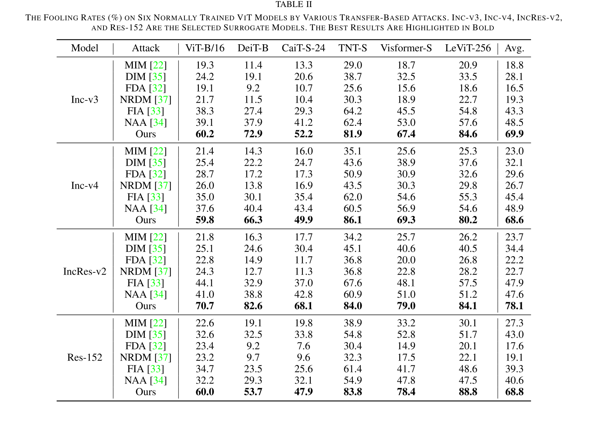
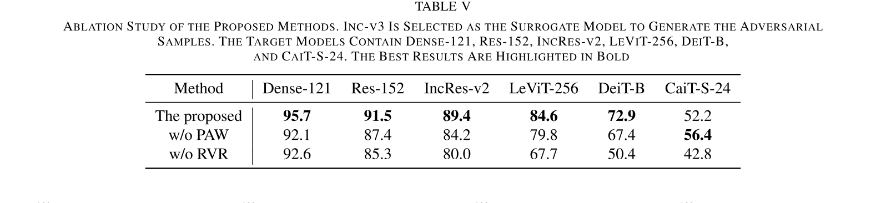

---
tags:
  - papers/adversarial-attacks
aliases:
  - CRFA
  - Critical Region-oriented Feature-level Attack
  - 关键区域特征攻击
date: 2024-05
doi: "10.1109/tifs.2024.3404857"
---

# Improving Transferability of Adversarial Samples via Critical Region-Oriented Feature-Level Attack

## 核心信息

- 标题: Improving Transferability of Adversarial Samples via Critical Region-Oriented Feature-Level Attack
- 标题翻译: 通过面向关键区域的特征级攻击提升对抗样本迁移性
- 作者: Zhiwei Li, Min Ren, Qi Li, Fangling Jiang, Zhenan Sun
- 机构: 中国科学院自动化研究所 (NLPR/MAIS, CASIA); 北京师范大学; 南华大学
- 发表时间: 2024 年 5 月 (发表于 TIFS Vol. 19, 2024)
- 发表渠道: IEEE Transactions on Information Forensics and Security (TIFS), Vol. 19, pp. 6650–6664
- DOI: 10.1109/tifs.2024.3404857
- 论文链接: https://ieeexplore.ieee.org/document/10538111
- 论文类型: 方法 (method)

## 原文摘要翻译

深度神经网络因其在计算机视觉中的显著进展而备受关注，但近期研究表明它们容易被精心制作的对抗样本欺骗。这些样本由特定攻击算法生成，能在不被人类察觉的情况下迷惑目标模型。最近，由于其高迁移性，特征级攻击成为研究焦点。现有最先进的特征级攻击都通过贪婪地改变模型注意力来提升迁移性。然而，对于包含多个目标类别物体的图像，不同模型的注意力可能存在显著差异。因此贪婪地改变注意力可能导致这些图像对应的对抗样本陷入代理模型的局部最优。此外，由于视觉 Transformer (ViT) 和卷积神经网络 (CNN) 之间存在巨大的结构差异，在 CNN 上通过特征级攻击生成的对抗样本更难成功攻击 ViT。为克服这些缺陷，本文提出关键区域导向的特征级攻击 (CRFA)。具体而言，我们首先提出==扰动注意力感知加权 (PAW)==，通过对对抗扰动进行特征级注意力加权来破坏图像的关键区域，同时尽可能不改变模型注意力。然后我们提出==区域 ViT 关键检索 (RVR)==，通过向解码器添加 ViT 的额外先验知识，使生成器能够适配对抗样本在 ViT 上的迁移性。大量实验证明了本方法取得的显著性能提升——相比最先进的特征级攻击方法，对 CNN 的愚弄率提高了 19.9%，对 ViT 提高了 25.0%。

## 创新点

1. **"温和破坏"替代"贪婪重定向"的路线转变**：先前特征级攻击 (FIA, NAA) 的范式是通过最大化模型注意力的偏移来使模型"失焦"——这假设不同模型对同一图像的注意力高度重叠。CRFA 的 PAW 模块开创了相反思路：==生成近似注意力图来指导扰动加权，在关键区域施加更强的扰动，但尽可能不改变模型注意力分布本身==。这是一个从"重定向注意力"到"尊重注意力结构、在其指引下精准破坏"的范式级创新。

2. **生成器框架的编码-双解码器架构**：PAW 不是直接使用代理模型计算出的精确注意力图来加权扰动（这会加剧对代理模型的过拟合），而是让==编码器将输入映射到潜在码，再由两个解码器分别生成近似注意力图和对抗扰动，两者相乘得到最终扰动==。精确注意力图仅作为监督信号（通过 L2 损失约束近似注意力图），而不直接参与前向计算。这种"学习近似而非直接使用"的策略有效缓解了代理模型过拟合。

3. **RVR：首个针对 ViT 架构特性的通用检索算法**：==RVR 通过逐个 mask 图像 patch、观察 ViT 输出概率的变化来检索对 ViT 分类决策有边际贡献的关键 patch，生成二值掩码==。这在概念上与 Shapley 值的边际贡献思想相通，但采用了更直接的贪心搜索实现。关键的是，RVR 不依赖任何 ViT 的梯度信息，可以在黑盒设置下运行，因此可以灵活嵌入任何攻击框架中。

4. **PAW 与 RVR 的双轨互补设计**：PAW 针对 CNN 的特征注意力结构设计，RVR 引入 ViT 的 patch 级空间先验。两者分别从"温和精准"和"跨架构兼容"两个维度同时提升迁移性，消融实验证明它们对 CNN 和 ViT 迁移各自贡献且正交互补。

## 一句话总结

CRFA 通过 PAW（扰动注意力感知加权：用近似注意力图引导扰动而不改变注意力分布）和 RVR（区域 ViT 关键检索：通过 patch 边际贡献搜索引入 ViT 空间先验）两条互补路线，同时解决了多目标图像上的代理模型过拟合和 CNN→ViT 跨架构迁移困难两个核心问题，在 CNN 和 ViT 目标上分别超越 NAA 达 19.9% 和 25.0%。

## 研究背景与问题

这篇论文抓住了现有特征级迁移攻击的两个痛点。第一，FIA、NAA 一类方法默认不同模型会关注相似区域，因此通过强行打散代理模型注意力来提升迁移性；但作者指出，当图像里同时出现多个目标物体时，不同模型的关注区域可能并不一致，这时“贪婪改注意力”反而会把样本推向代理模型的局部最优。第二，现有特征级方法大多围绕卷积神经网络的中间特征层设计，因此虽然在卷积神经网络之间迁移不错，但很难迁移到视觉 Transformer。

作者的目标不是单纯提高某一组模型上的分数，而是同时解决这两个更底层的问题：一方面降低多目标图像下的代理模型过拟合，另一方面缓解卷积神经网络与视觉 Transformer 之间的结构鸿沟。因此论文把任务自然拆成两个子目标：PAW 负责处理卷积神经网络场景下的关键区域扰动分配，RVR 负责引入目标架构的图像块级先验。
### 特征级攻击的天然缺陷：注意力偏移假设何时会失效

近年来，特征级攻击（FIA, NAA）已成为迁移攻击的主流方向。其核心思想是对代理模型中层的神经元激活进行扰动，利用不同模型在关键特征上的共享性来获得跨模型迁移。然而这些方法隐含地依赖一个假设：不同模型对同一图像的注意力区域高度重叠。

这个假设在单目标图像（图像中只包含一个类别的物体）上大致成立。但在多目标图像（图像中同时出现多个类别的物体，如"狗+飞盘"）上会系统性失效——如 Fig. 1 所示，不同模型可能将注意力分配到不同的目标物体上。此时，FIA/NAA 的做法是强制改变代理模型的注意力使之偏离原始聚焦区域，但如果目标模型的注意力恰好与原始聚焦区域重叠，对抗样本就会失效。Fig. 2 证实了这一现象：NAA 攻击后，代理模型注意力大幅偏离原图，但目标模型的注意力在对抗样本和原图上高度重叠——攻击失败了。

### CNN→ViT 跨架构迁移的系统性障碍

CNN 和 ViT 的特征提取机制存在结构性差异：CNN 通过局部卷积核逐层聚合空间信息，ViT 通过自注意力在全局范围内建立 patch 间的 token 交互。特征级攻击依赖于操纵 CNN 中间层的特征图和神经元激活，这种方法生成的扰动模式天然适配了 CNN 的归纳偏置，对 ViT 的效果大打折扣。已有工作大多分别研究 CNN 上的迁移或 ViT 上的攻击，几乎没有人尝试缩小两者之间的鸿沟。

![[1_attention.jpg]]
*Fig. 1: Visualization of model attention. For single-object images (left two), different models focus on similar regions. For multiple-object images (right two), the attention of different models may differ significantly.*
![[2_naa_attention.jpg]]
*Fig. 2. Visualization of model attention on the original image and the adversarial sample produced by NAA. There is a large overlap in the target model’s attention on the adversarial sample and the original image.*

### CRFA 的核心动机

CRFA 的设计直指上述两个问题：PAW 通过"不改变注意力结构，只在注意力指导下精准加权扰动"来解决多目标图像过拟合；RVR 通过"检索对 ViT 输出有边际贡献的 patch"来引入 ViT 架构先验，在不接触 ViT 梯度的情况下弥合 CNN-ViT 鸿沟。

## 方法主线

most of the previous feature-level attacks ***rely heavily on the gradient information*** of the surrogate model to a single input image, thus easily falling into overfitting to the surrogate model.
--> a generator-based approach to learn a direct mapping of the input images to the adversarial samples
--> 采用基于生成器的方法，学习输入图像与对抗样本的直接映射：this mapping is learned from the ***training data*** ***distribution*** rather than from individual images, the generated adversarial samples can effectively mitigate overfitting.
--> To further enhance the cross-model transferability, ***==certain prior knowledge==*** is added in the generator optimization process to assist the generator to pay more attention to sensitive regions
### 机制流程

CRFA 的整体框架包含三个组件：一个编码-双解码器生成器 G、PAW （Perturbation Attention-Aware Weighting）模块、RVR （Region ViT-Critical Retrieval）模块。

**步骤 1（编码与生成）：** 输入图像 x 经编码器 E 映射为潜在码 z = E(x)。解码器 D1 从 z 生成近似注意力图 $\tilde{A}^t_k(x) = D_1(z)$；解码器 D2 从 z 生成初始对抗扰动 $\delta = D_2(z)$。

**步骤 2（PAW 注意力加权）：** 用近似注意力图对初始扰动做逐元素加权：
$$\delta' = \delta(1 + \tilde{A}^t_k(x) \cdot \alpha)$$
注意力高的区域获得更大的扰动系数，注意力低的区域保持不变。$\alpha$ 为固定的缩放因子（默认 $\alpha=2.5$），控制加权强度。

**步骤 3（RVR 关键区域检索与二次加权）：** RVR 在原始图像 x 上检索对 ViT 分类有边际贡献的 patch，输出二值掩码 M（关键区域为 0）。对扰动进行二次加权：
$$\delta'' = \delta' \odot (1 - M) \cdot \beta + \delta'$$
$\beta$ 为可学习的缩放因子，与生成器同步优化。

**步骤 4（生成最终对抗样本）：** $x^{adv} = x + \epsilon \cdot \tanh(\delta'')$，通过 $\tanh$ 和 $\epsilon$ 约束扰动在 $l_\infty$ 范围内。

![[3_framework.jpg]]
*Fig. 3: The CRFA framework. The generator contains one encoder and two decoders. PAW weights perturbations with attention maps. RVR introduces ViT prior knowledge.*

### 扰动注意力感知加权 (PAW)

PAW 首先通过反向传播梯度与神经元激活值计算特征重要性图：
$$\alpha^c_k(x)[t] = \frac{1}{M} \sum_i \sum_j \frac{\partial f_\theta(x)[t]}{\partial A^c_k(x)[i, j]}$$
其中 $A^c_k(x)[i,j]$ 是第 k 层第 c 个特征图中空间位置 $[i,j]$ 的激活值。然后对所有通道做加权求和并上采样到输入尺寸：
$$\tilde{A}^t_k(x) = \text{Upsample}\left(\sum_c (A^c_k(x) \cdot \alpha^c_k(x)[t])\right)$$

与 Grad-CAM 的关键差异是：==PAW 去掉了 ReLU 操作，保留了负权重。负权重对应非关键区域，保留它们能让生成器学习区分关键与非关键区域间的精细边界，而非贪婪地将非关键区域权重置零。==

### 区域 ViT 关键检索 (RVR)

ViT classifier splits an image into many patches as input, which contain all the information of the image. The importance of each patch is different. If these important patches can be selected as prior knowledge to guide the generator to craft adversarial samples, then it is possible to improve the transferability of the adversarial samples on ViTs.
--> we measure the importance of patches by ***computing their marginal contribution to the probability of the groundtruth label***.
$$\displaystyle \varphi_s = F(x)[t] - F(x \odot M_s)[t]$$
其中 Ms 表示将集合 s 中所有补丁设为零后的二叉遮罩。则，补丁集 s 的边际贡献 φs 定义为将当前输入图像与元素 Ms 乘以后，属于基层真实标签 t 的输出 logit 值的约减。

RVR 的核心是一个贪心搜索算法（见原文 Algorithm 1）：
1. 将图像划分为 N 个 patch，初始化全 1 掩码 M
2. 依次尝试 mask 每个 patch，记录每次 mask 后 ViT 对真实标签 t 的输出概率
3. 选择使概率下降最大的 patch，将其在 M 中置零，永久从图像中移除
4. 用更新后的图像重复上述过程，直到模型被误分类或所有 patch 都已被选中
5. 最终 M 中为 0 的区域即为"对 ViT 分类决策有关键影响的区域"

二值掩码 (1-M) 识别出关键 patch，通过与扰动逐元素相乘引入 ViT 的空间先验。RVR 只需访问 ViT 的输入输出（无需梯度），可在黑盒设置下运行。
![[4_algorithm1.jpg]]

### 损失函数

损失联合优化生成器：
- **对抗损失**：$L_{adv} = f_\theta(x^{adv})[t]$，最小化对抗样本对真实标签的输出概率
- **注意力损失**：$L_{attn} = \|D_1(z) - \tilde{A}^t_k(x)\|_2$，约束近似注意力图接近精确注意力图
- **总体损失**：$L = L_{adv} + \lambda L_{attn}$，$\lambda=5$ 为默认设置

## 实验设计

### 数据集与模型

- **训练集**：ImageNet 验证集 50,000 张图像
- **测试集**：NIPS 2017 对抗竞赛数据集 1,000 张
- **CNN 目标模型（9 个）**：Inc-v3, Inc-v4, IncRes-v2, Res-50, Res-152, VGG16, VGG19, Dense-121, Dense-201
- **ViT 目标模型（6 个）**：ViT-B/16, DeiT-B, CaiT-S-24, TNT-S, Visformer-S, LeViT-256
- **额外验证模型**：ConvNeXt-T, RepLKNet-B (新型 CNN); MAE-B, DEiT-B/L, DEiT-v2-B (自监督 ViT); Mixer-B (MLP)
- **代理模型**：Inc-v3, Inc-v4, IncRes-v2, Res-152

### 攻击设置与超参数

- 扰动约束：$l_\infty$，$\epsilon = 16/255$
- PAW 注意力权重 $\alpha = 2$
- RVR 权重 $\beta$：可学习，随生成器训练优化
- 注意力损失权重 $\lambda = 5$

### 基线方法

8 个对比方法：MIM, DIM（梯度级迁移攻击）; FDA, NRDM, FIA, NAA（特征级攻击）; 还涉及 TIM, SINI-V2 等。NAA 和 FIA 是最直接可比的特征级 SOTA。

## 核心实验结果

### CNN 跨模型迁移：大幅度超越 SOTA

![[5_foolingrates.jpg]]
*Table I: Fooling rates (%) on nine normally trained CNN models. Inc-v3, Inc-v4, IncRes-v2, and Res-152 are surrogate models.*

四个代理模型上的平均结果：
- NAA 对 CNN 目标的平均愚弄率为 74.9%，FIA 为 77.5%
- CRFA 达到 92.4%（Inc-v4 源）至 96.4%（IncRes-v2 源），平均超越 NAA 19.9%、FIA 17.3%
- MIM 仅 53.2%，DIM 约 65.6%，FDA/NRDM 在 60-70% 范围

更复杂的代理模型（如 IncRes-v2）产生更强迁移性——这与"更鲁棒的代理模型更难攻击，因此在其上成功攻击的对抗样本也更能迁移到较弱目标"的直觉一致。

### ViT 跨架构迁移：RVR 的关键作用

*Table II: Fooling rates (%) on six ViT models. Adversarial samples crafted on CNNs.*

- NAA 对 ViT 的最高平均愚弄率仅为 48.9%
- CRFA 达到 78.1%（IncRes-v2 源），使用 Res-152 作为源时也达到 78.1%
- MIM 对 ViT 不到 30%，DIM 不到 43%
- 早期特征级攻击 FDA 在 ViT 上的表现甚至不如 MIM——进一步说明不加区分的特征破坏对跨架构迁移完全无效

### 多目标图像：PAW 弥补了传统特征攻击的核心短板

![[6_table3.jpg]]
*Table III: Comparison on single-object vs multiple-object test sets. Inc-v3 is the surrogate model.*

- NAA 在单目标子集上愚弄率上升 2.8%，但在多目标子集上下降 14.5%
- NAA 在单目标 vs 多目标之间的表现差异高达 17.3 个百分点
- CRFA 在多目标子集上比 NAA 高出 23.0%，证明 PAW 的"不改变注意力"策略在多目标场景下的关键优势

### 先进模型与 MLP 架构的泛化验证

![[Papers/Adversarial-Attacks/CRFA/images/7.jpg]]
*Fig. 4: Fooling rates on two new convolution models, four self-supervised ViTs, and one MLP model.*

对新型 CNN（ConvNeXt-T, RepLKNet-B）和自监督 ViT（MAE-B, DEiT-B/L/v2），CRFA 相比 FIA/NAA 提升超过 25%。对 Mixer-B（MLP 架构），CRFA 也显著优于所有基线——表明 RVR 引入的 patch 空间先验甚至对非 Transformer 架构也有帮助。

### 视觉质量评估

![[Papers/Adversarial-Attacks/CRFA/images/8.jpg]]
*Table IV: Visual quality evaluation. PSNR, SSIM, RMSE under the same l∞ constraint ε=16.*

Peak Signal-to-Noise Ratio (PSNR), Structural Similarity Index Measure (SSIM), and Root Mean Squared Error (RMSE)
峰值信噪比（PSNR）、结构相似指数测度（SSIM）和均方根误差（RMSE），以评估四个替代模型在相同扰动阈值下生成的对抗样本的平均视觉质量。

在相同的 $l_\infty$ 约束下，CRFA 的 PSNR 和 SSIM 与基线持平，但 RMSE 显著更小。这说明 PAW 的注意力加权使扰动更集中在关键区域，在非关键区域减少了不必要的扰动强度，视觉上更不易察觉。

### 消融实验：PAW 与 RVR 各自独立且互补

*Table V: Ablation study. Inc-v3 is surrogate. Target: Dense-121, Res-152, IncRes-v2 (CNN); LeViT-256, DeiT-B, CaiT-S-24 (ViT).*

- 移除 PAW：CNN 平均愚弄率从 92.2% 降至 87.9%；ViT 目标也普遍下降，说明 PAW 也是 RVR 的平衡手段
- 移除 RVR：ViT 目标显著下降（幅度大于 CNN），证实 RVR 是跨架构迁移的核心驱动力
- CRFA 完整版在所有六个目标上均为最优

### 关键超参数分析

![[Papers/Adversarial-Attacks/CRFA/images/9.jpg]]
*Fig. 5: Model attention changes on the original image and CRFA adversarial sample. CRFA successfully attacks without significantly changing attention.*

![[10_a.jpg]]
*Fig. 6: Effect of attention weight α. α varies from 1 to 3.5. Left: six individual target models. Right: average across all CNNs, ViTs, and overall.*

- $\alpha$ 在 1–2.5 范围内愚弄率基本稳定，超过 3 后轻微下降——过强的注意力加权可能导致过拟合
- $\alpha=2.5$ 是默认值，兼顾 CNN 和 ViT 表现

![[11_ru.jpg]]
*Fig. 7: Effect of Ladv to Lattn ratio λ. λ varies from 1 to 7.*

- $\lambda$ 过小（1）：注意力损失过强，扰动了注意力分布本身 → 迁移性下降
- $\lambda$ 过大（7）：注意力损失过弱，近似注意力图监督不充分 → 迁移性下降
- $\lambda=5$ 取得平衡

## 讨论与局限

### 论文证明了什么

论文比较扎实地证明了三个核心命题：其一，多目标图像上不同模型的注意力存在结构性差异，这使得"贪婪改变注意力"的范式（FIA/NAA）系统性失效——从定性的注意力可视化和定量的单/多目标子集对比中得到了一致的证据。其二，PAW 的"在注意力结构内精准破坏而非改变注意力"的路线在多目标场景下显著优于传统的注意力操纵路线。其三，RVR 通过 patch 边际贡献检索引入的 ViT 空间先验，是弥合 CNN→ViT 跨架构鸿沟的有效且通用的手段——不仅对 ViT 有效，对 MLP-Mixer 也有帮助。

### 论文没有证明什么

1. **PAW 是否在所有特征层上均衡有效**：实验仅在 Inc-v3 的 mixed4 层计算注意力图。不同层的特征粒度不同（浅层纹理 vs 深层语义），在更浅或更深的层上 PAW 是否同样有效未被探讨。

2. **RVR 的 patch 粒度影响**：RVR 需要预定义 patch 大小（与 ViT 的 patch embedding 一致），但不同 ViT 的 patch 大小不同（如 16×16 vs 32×32）。RVR 对 patch 大小的敏感性以及如何适配不同 ViT 未被分析。

3. **更细粒度的 patch 加权**：当前 RVR 输出二值掩码（关键/非关键），论文在 Discussion 中也承认更精细的连续值加权可能进一步提升性能。二值化是否丢失了重要信息是一个开放问题。

4. **防御评估**：没有测试 CRFA 生成的对抗样本在对抗训练或输入变换防御下的鲁棒性。

### 值得关注的局限

- **生成器训练的计算开销**：CRFA 的生成器需要完整的前向-反向训练，而非像 FIA/NAA 那样直接对单张图像做迭代优化。虽然推理阶段只需一次前向传播即生成对抗样本，但训练成本不容忽视。
- **RVR 的计算复杂度**：RVR 对每张图像都需要执行贪心 patch 搜索（O(N²) 次 ViT 前向传播），虽然在实际实现中可以通过预计算和批处理优化，但论文未讨论具体耗时。
- **对 ViT 代理模型的依赖**：RVR 需要至少一个白盒 ViT 来进行 patch 检索。如果完全没有可访问的 ViT（即连 ViT 代理模型都没有），RVR 将不可用。

## 总结与启发

### 方法论层面的启发

CRFA 最值得借鉴的设计哲学是：攻击不一定需要"最大程度地改变"某些东西，有时"在最需要改变的精确位置进行最小但精准的改变"更有效。PAW 的相对保守策略（保持注意力不变、在注意力指引下加权扰动）最终竟产生了比"贪婪重定向注意力"更高的迁移性——这对迁移攻击领域是一个重要的范式启示。RVR 则展示了如何在完全不接触 ViT 梯度的情况下，通过简单的输出观测来获得有效的架构先验。

### 工程复用指南

- 生成器架构：编码-双解码器结构（3 个卷积块 + 6 个残差块组成编码器，2 个转置卷积解码器），可直接复现。
- PAW 的注意力图计算复用了 Grad-CAM 的核心公式但移除了 ReLU——在实现中这是一个一行代码的改动。
- RVR 是独立于生成器的模块，可以单独提取出来嵌入其他攻击框架。它只需要 ViT 的输入和输出，不依赖梯度。
- 默认超参数：$\epsilon=16/255$, $\alpha=2.5$, $\lambda=5$。$\alpha$ 在 1–2.5 范围内稳定，调参负担低。

### 后续研究可以关注的方向

1. RVR 能否从二值掩码升级为连续值权重（基于实际边际贡献的大小而非仅是排序）？
2. PAW 的多层注意力图融合（浅层+中层+深层）能否进一步提升性能？
3. CRFA 生成的对抗样本在对抗训练防御下的鲁棒性如何？
4. RVR 的思想能否推广到其他跨架构场景（如 CNN→MLP-Mixer、ViT→Mamba）？
5. PAW 的"保守注意力策略"能否作为防御方的对抗训练增强手段（即用 CRFA 生成的对抗样本做对抗训练，迫使模型学习更鲁棒的注意力分布）？

## 参考文献与后续阅读

核心被引文献：

- **FIA**: Wang et al., "Feature Importance-aware Transferable Adversarial Attacks", ICCV 2021 — PAW 的直接对比基线，通过特征重要性加权攻击
- **NAA**: Zhang et al., "Improving Adversarial Transferability via Neuron Attribution-based Attacks", CVPR 2022 — 当时 SOTA 特征级攻击，CRFA 的主要对比对象
- **FDA**: Ganeshan et al., "FDA: Feature Disruptive Attack", ICCV 2019 — 早期特征级攻击
- **NRDM**: Naseer et al., "Task-Generalizable Adversarial Attack based on Perceptual Metric", 2018 — 跨任务迁移攻击
- **MIM**: Dong et al., "Boosting Adversarial Attacks with Momentum", CVPR 2018
- **DIM**: Xie et al., "Improving Transferability of Adversarial Examples with Input Diversity", CVPR 2019
- **Grad-CAM**: Selvaraju et al., "Grad-CAM: Visual Explanations from Deep Networks via Gradient-based Localization", ICCV 2017 — PAW 注意力图计算的数学基础
- **ViT**: Dosovitskiy et al., "An Image is Worth 16x16 Words", ICLR 2021
- **DeiT**: Touvron et al., "Training Data-Efficient Image Transformers", ICML 2021

---

*笔记生成日期：2026-06-12*
