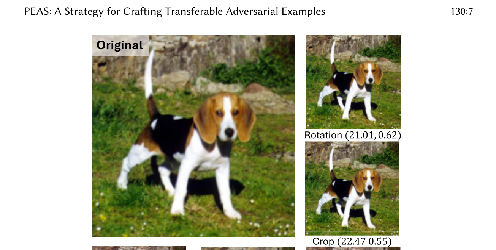
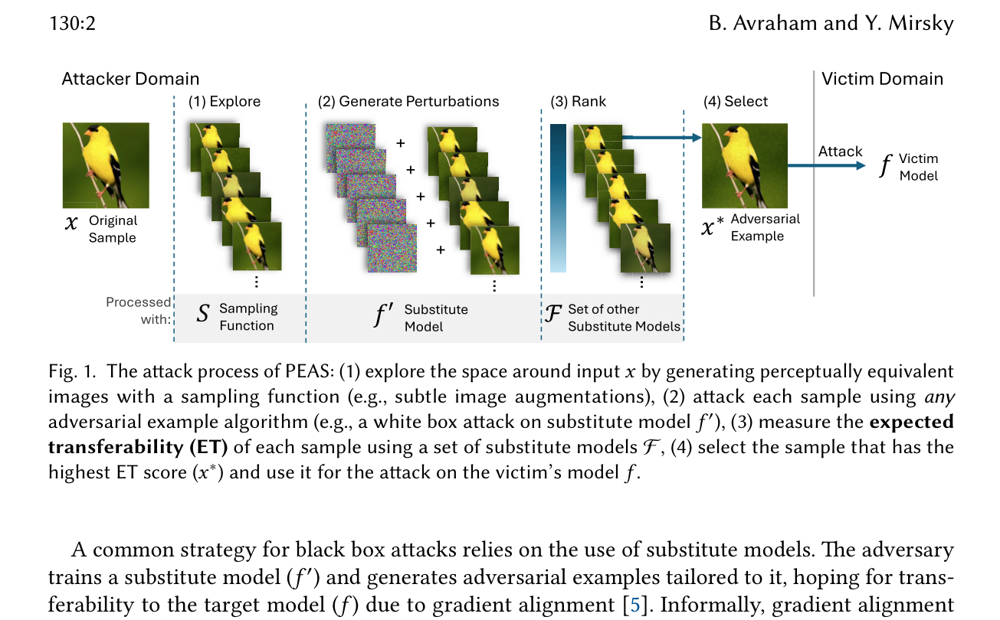
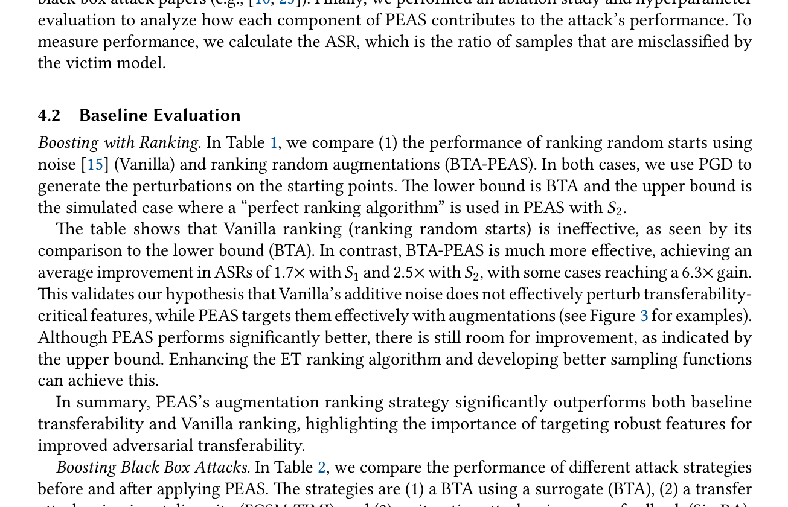
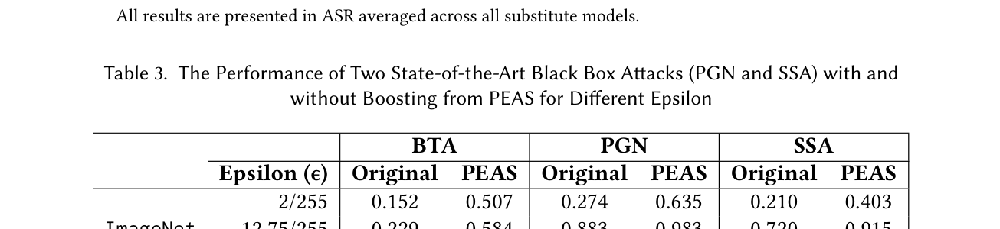
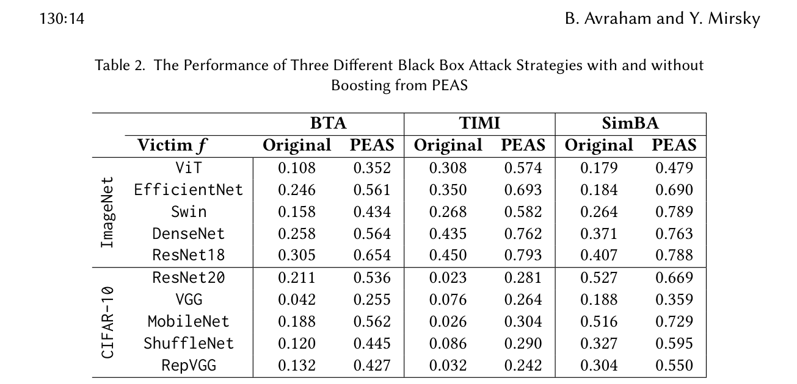
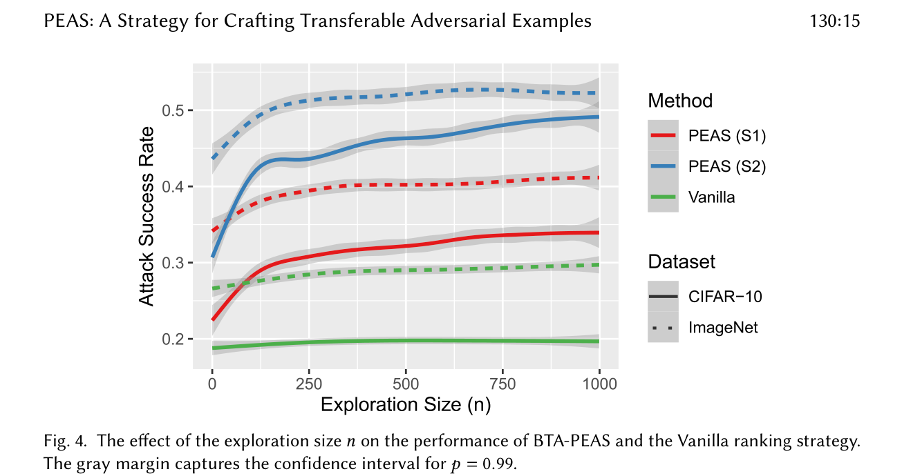
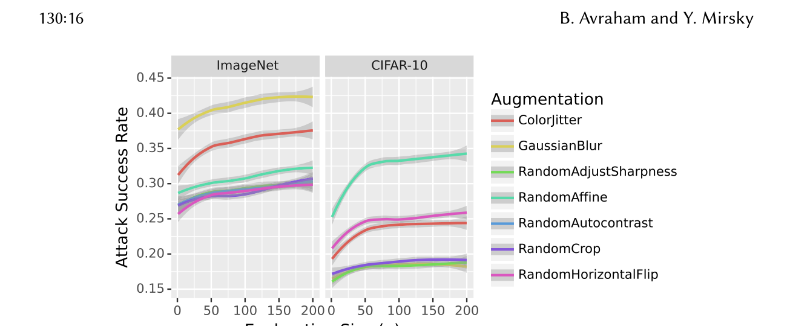
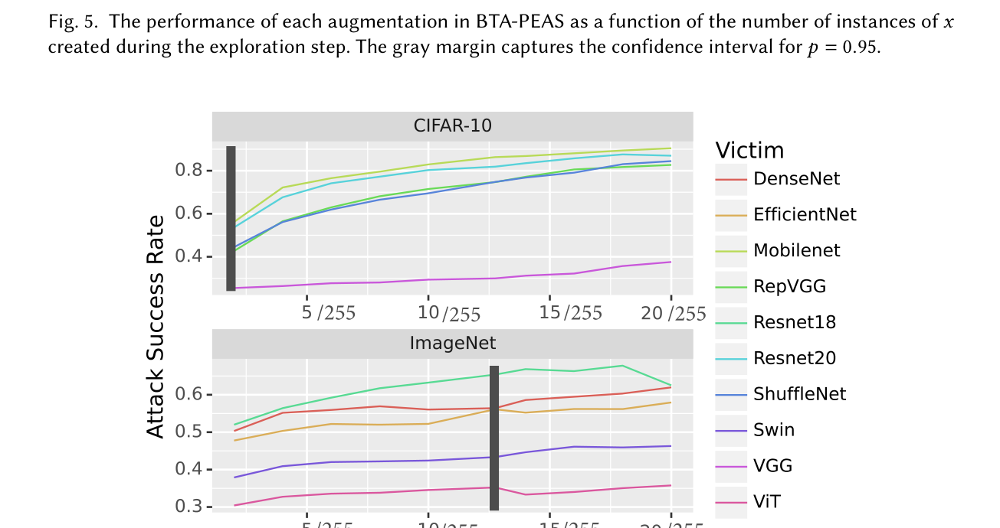
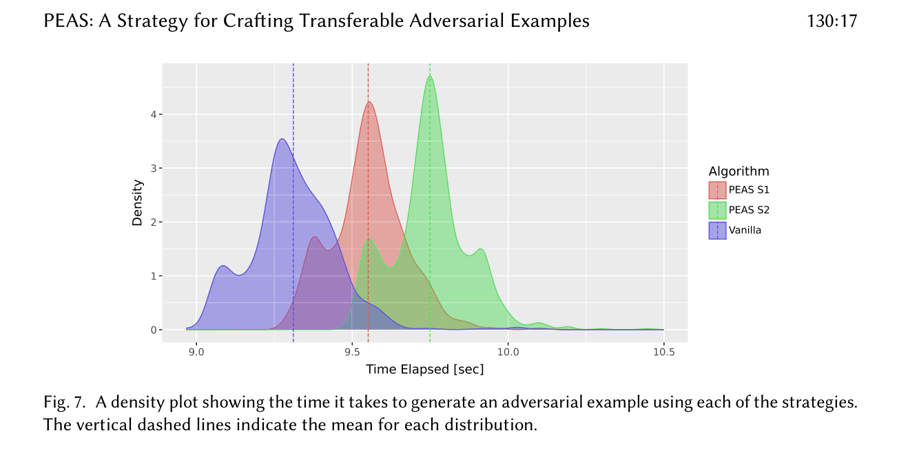

---
tags:
  - papers/adversarial-attacks
aliases:
  - PEAS
  - Perception Exploration Attack Strategy
  - 感知探索攻击策略
date: 2025-10
doi: "10.1145/3763003"
---

# PEAS: A Strategy for Crafting Transferable Adversarial Examples

## 核心信息

- 标题: PEAS: A Strategy for Crafting Transferable Adversarial Examples
- 标题翻译: PEAS：一种制作可迁移对抗样本的策略
- 作者: Bar Avraham, Yisroel Mirsky
- 机构: 本·古里安大学 (Ben-Gurion University of the Negev), 以色列
- 发表时间: 2025 年 10 月
- 发表渠道: ACM Transactions on Intelligent Systems and Technology (TIST), Vol. 16, No. 6, Article 130
- DOI: 10.1145/3763003
- 代码 / 项目: https://github.com/BarAvraha/PEAS
- 论文类型: 方法 (method)

## 原文摘要翻译

黑盒攻击——攻击者对目标模型仅有有限了解——对机器学习系统构成重大威胁。使用替代模型生成的对抗样本往往在向目标模型的迁移性上表现有限。虽然近期工作探索了通过对扰动进行排序来提高成功率，但这些方法仅取得了有限的进展。我们提出了一种称为 PEAS 的新策略，可以提升现有黑盒攻击的迁移性。PEAS 利用了一个关键洞察：==感知上等价的样本在对抗迁移性上表现出显著的差异性==。我们的方法首先通过微妙的增强从初始样本生成一组图像，然后使用一组替代模型评估这些图像上对抗扰动的迁移性，最后选择最具迁移性的对抗样本用于攻击。实验表明，PEAS 可以使现有攻击的性能翻倍，平均攻击成功率比当前排序方法提升 2.5 倍。我们在 ImageNet 和 CIFAR-10 上对 PEAS 进行了全面评估，分析了超参数影响，并通过消融实验验证了每个组件的重要性。除性能外，PEAS 还引入了一个基于感知等价性的新型搜索空间，挑战了对抗机器学习中普遍使用的 ε-ball 约束，并揭示了仅凭自然增强就足以引发对抗性失败。

## 创新点

1. **从 ε-ball 到感知等价性：搜索空间的范式突破**：传统对抗攻击几乎被 p-norm（尤其是 $l_\infty$）约束所统治——对抗扰动必须落在以原图为中心的 ε 半径小球内。PEAS 从根本上挑战了这一范式：论证了"感知等价性"（人眼无法分辨差异）作为 stealth 约束远比 p-norm 更有意义。一个两像素的平移可以产生巨大的 $l_2$ 和 $l_\infty$ 距离，但人眼完全无法感知——这说明 p-norm 和人类感知之间的相关性极差。

2. **"更好的起点"而非"更好的扰动"**：传统迁移攻击的优化思路是在当前点上寻找"更好的扰动方向"（通过动量、输入变换、梯度修正等手段）。PEAS 的洞见完全不同——重要的不是扰动本身质量，而是攻击的起始点。通过微妙的图像增强（旋转 2°、平移 3px、高斯模糊）将起始点移动到代理模型和目标模型决策边界更对齐的位置，然后在此位置上使用任意基础攻击——这就是 PEAS 只带来 2-5% 额外开销却能带来 2.5 倍 ASR 提升的根本原因。

3. **首次将迁移性排序用于制作攻击**：Levy et al. (2022) 提出了 ET (Expected Transferability) 指标来排序已有对抗样本的迁移性，但对其应用局限于"从多个已生成的对抗样本中筛选"。PEAS 首次展示了 ET 排序可以用来主动制作对抗样本——先探索多个感知等价起点，用 ET 筛选出最具迁移潜力的，再在其上生成对抗扰动。实验结果证明，在 ε-ball 内的随机噪声重起点对 ET 排序无效（与 Levy et al. 的发现一致），而感知等价增强版本的搜索空间恰好提供了 ET 排序所需的迁移性变异性（variability）。

4. **自然增强本身即可构成对抗攻击**：消融实验中的"Random Augmentation"列显示了一个惊人的发现：不施加任何对抗扰动，仅凭精心选择的自然增强（如轻微旋转+平移+模糊的组合）就可以实现 13.6%（ViT）到 22.8%（DenseNet）的 ASR。这意味着 DNN 的脆弱性不仅限于人为设计的对抗扰动，自然界中常见的细微变化同样足以破坏模型决策。

## 一句话总结

PEAS 通过将对抗攻击的搜索空间从 p-norm ε-ball 拓展到感知等价空间，用微妙的自然增强探索大量更靠近跨模型共享决策边界的起点，再用 ET 排序选择最具迁移潜力的样本施加对抗扰动，作为即插即用包装器平均提升现有黑盒攻击 ASR 2.5 倍，且仅增加 2.6-4.7% 的计算开销。

## 研究背景与问题

### ε-ball 为什么限制迁移性？

*Fig. 2: Small spatial and photometric changes yield large p-norm distances yet remain imperceptible. A 2px translation or 2° rotation can push an image far outside the usual ε-ball while being invisible.*

Levy et al. (2022) 发现，在多个随机起点中总存在一个"幸运起点"，从此点出发的对抗样本迁移性显著更高。传统方法使用 ε-ball 内的随机噪声随机重起点（random restarts），但这些重起点被困在 ε-ball 的狭小邻域内。如果该邻域恰好与目标模型的梯度方向不匹配（即代理模型和目标的损失地形在此处不对齐），无论有多少次重起点都无济于事。

PEAS 的关键洞见：微妙的图像增强（旋转、平移、模糊、色彩抖动）能扰动"鲁棒特征"（robust features）——那些不同模型共享的、对人类感知至关重要的特征——从而将搜索点移动到共享决策边界更密集的区域。而 ε-ball 内的随机噪声只扰动非鲁棒特征（高频纹理），对迁移性帮助微乎其微。

### 感知等价性作为有原则的搜索空间

PEAS 的理论基础建立在心理物理学（psychophysics）的 JND（Just-Noticeable Difference，最小可觉差）概念上：低于 JND 阈值的修改不会被人类观察者可靠地检测到。每个增强参数被谨慎地限制在 JND 范围内（如旋转 $[-2°, 2°]$、平移 $[-3, 3]$ px、高斯模糊 $k=3$、色彩抖动强度 0.05）。

## 方法主线

### 机制流程

*Fig. 1: The attack process of PEAS: (1) explore the space around x by generating perceptually equivalent images, (2) attack each sample, (3) measure expected transferability (ET), (4) select the sample with the highest ET.*

PEAS 的每次攻击按以下四步执行：

**步骤 1（感知探索）：** 使用采样函数 S 对原始图像 x 生成 n 个感知等价的变体 $X = \{x_1, x_2, ..., x_n\}$。

**步骤 2（对抗扰动生成）：** 对每个 $x_i \in X$ 使用任意攻击算法（如 PGD on $f'$）生成对抗样本 $X' = \{x'_1, x'_2, ..., x'_n\}$。

**步骤 3（迁移性估计）：** 使用一组替代模型 $\mathcal{F}$（不含用于攻击生成的模型 $f'$）计算每个 $x'_i$ 的 ET 分数：
$$\text{ET}_\mathcal{F}(x) = \frac{1}{|\mathcal{F}|} \sum_{f \in \mathcal{F}} [1 - \sigma_y(f(x))]$$
其中 $\sigma_y$ 是原始类别 y 对应的 softmax 输出。ET 本质上是"该对抗样本在多少个替身模型上成功了"的连续性度量。

**步骤 4（样本选择）：** 选择 ET 最高的 $x' \in X'$ 作为最终攻击样本 $x^*$。

### 两种采样策略

**策略 S1：单随机增强。** 每次从增强集合 $\mathcal{A}$（包含 Rotation, Translation, ColorJitter, GaussianBlur, RandomAffine 等）中随机选择一个增强，以配置好的参数应用。S1 更隐蔽——只改动一种属性；但偶尔会退回决策边界内（过拟合方向）。

**策略 S2：混合增强。** 每次对所有增强都应用。S2 效果更强（平均 ASR 更高），因为多增强的组合创造了更鲁棒的起点。实验结果（Table 4）显示 S2 对"欺骗性增强样本"（naturally misclassified augmented samples）的容忍度更高——过滤掉这些样本后 S1 的 ASR 上升而 S2 下降，说明 S2 的起点原本就已经深入共享决策边界。

### 感知等价性的保证

PEAS 通过两层防御确保 $x^*$ 的感知等价性：(1) 增强参数严格控制（基于 JND 阈值的手动标定）；(2) 攻击者可进行最终目视检查（adversary-in-the-loop verification）——如果感知到任何异常，丢弃并重新运行。

## 实验设计

### 数据集与模型

- **数据集**：ImageNet (224×224, 1000 类) 和 CIFAR-10 (32×32, 10 类)，各取 1000 张测试样本
- **ImageNet 模型（5 个）**：ViT, Swin-T, DenseNet-121, EfficientNet, ResNet-18
- **CIFAR-10 模型（5 个）**：ResNet-20, VGG-11, RepVGG-A0, ShuffleNet v2, MobileNet v2
- 每种设置下：1 个目标模型 $f$ + 1 个攻击代理模型 $f'$ + 3 个排序代理模型 $\mathcal{F}$

### 攻击设置

- 扰动预算：CIFAR-10 ε=2/255，ImageNet ε=12.75/255
- 探索样本数 n=200
- 增强集合：Rotation(±2°), Translation(±3px), ColorJitter(0.05), GaussianBlur(k=3), RandomAffine(±2°)

### 基线方法

- Lower Bound: BTA（naive transfer）
- Vanilla Ranking: BTA + ε-ball random restarts + ET ranking
- 5 种被 PEAS 包装的攻击：BTA, FGSM-TIMI, SimBA, PGN, SSA

## 核心实验结果

### 基线评估：PEAS 大幅超越随机重启排序

*Table 1: ASR of BTA-PEAS compared to Vanilla ranking. ImageNet results.*

- Vanilla ranking（ε-ball 内随机噪声重起点 + ET 排序）几乎无效，仅比 BTA lower bound 高几个百分点——这与 Levy et al. 的结论一致
- BTA-PEAS S1：平均 1.7× ASR 提升
- BTA-PEAS S2：平均 2.5× ASR 提升，个别组合达 6.3×（如 ViT→EfficientNet: 0.138 → 0.376）
- 上界（Perfect Ranking）在 CIFAR-10 上可达 0.9+，表明 PEAS 仍有提升空间

### 对现有攻击的加成效果

*Table 2: Performance of BTA, TIMI, and SimBA with and without PEAS boosting.*

- BTA + PEAS：ImageNet 平均 ASR 从 0.215 升至 0.513（2.4×）；CIFAR-10 从 0.139 升至 0.445（3.2×）
- TIMI + PEAS：ImageNet 从 0.362 升至 0.681（1.9×）；CIFAR-10 从 0.049 升至 0.276（5.6×）
- SimBA + PEAS：ImageNet 从 0.281 升至 0.702（2.5×）；CIFAR-10 从 0.372 升至 0.580（1.6×）

对 SOTA 方法的提升（Table 3）：PGN + PEAS 在 ε=12.75 时 ImageNet 达 0.983；SSA + PEAS 在 ε=12.75 时 CIFAR-10 达 0.978。

### 消融实验：每个组件的独立贡献

*Table 4: Ablation study. Each column represents a different strategy.*

关键发现：
1. **增强不是靠"自然误分类"蒙混过关**："Random Augmentation"（仅增强不攻击）的 ASR 仅为 2-6%，远低于"Top-1 Adversarial Example"（25-65%），排除了"PEAS 只是碰巧选中了自然就会被误分类的增强样本"这一 trivial 解释。
2. **仅增强即可攻击**：Top-1 augmented sample（ET 选出的最佳增强样本，不加扰动）也达到了可观的 ASR（13.6-22.8% for ViT），证明纯粹的自然增强也足以构成对抗威胁。
3. **增强 + 扰动 > 仅增强 > 仅扰动**："Top-1 Adversarial Example" > "Top-1 Augmentation" > "Random"，证实增强作为起点 + 扰动作为推力的组合效果最佳。
4. **S2 > S1**：混合增强比单增强更鲁棒。

### 超参数分析

*Fig. 4: Effect of exploration size n. Even with n=1, BTA-PEAS outperforms Vanilla ranking.*

- n=1 时 BTA-PEAS 已超越 Vanilla Ranking，支持"单个增强样本就比 ε-ball 内的随机噪声更有效"这一核心主张
- 性能在 n≈200 时趋于收敛

*Fig. 5: Performance of each augmentation individually.*

- **ImageNet（高分辨率）**：GaussianBlur 最有效——通过移除细节迫使攻击聚焦于鲁棒特征
- **CIFAR-10（低分辨率）**：RandomAffine 最有效——低分辨率下空间变换对鲁棒特征的对齐和大小的改变更剧烈

*Fig. 6: Effect of ε-budget. ViT exhibits more gradual improvement compared to CNNs.*

ε 增大时 ASR 单调提升，但不同架构的敏感性不同：ViT 提升更平缓，ResNet 提升更陡峭——这暗示 ViT 的决策边界可能比 CNN 更平滑。

### 计算效率

*Fig. 7: Runtime distribution. PEAS adds only 2.6-4.7% overhead.*

- Vanilla (ε-ball 随机重启 200 次)：9.31 秒/样本
- PEAS S1：9.55 秒/样本（+2.6%）
- PEAS S2：9.75 秒/样本（+4.7%）
- 绝对增量 200-400ms，完全可忽略

## 讨论与局限

### 论文证明了什么

论文扎实地证明了四个层次：第一，p-norm 和感知等价性本质上是不相关度量——证明了 ε-ball 这个自对抗攻击诞生以来几乎被默认为"唯一合理约束"的东西在概念上是有缺陷的。第二，增强→ET 排序→选最佳的范式确实大幅优于 ε-ball 内随机重启。第三，PEAS 对不同基础攻击（BTA, TIMI, SimBA, PGN, SSA）、不同数据集（ImageNet, CIFAR-10）、不同架构（CNN, ViT, Swin）具有一致的通用性。第四，自然增强本身（无对抗扰动）可以构成对抗威胁。

### 论文没有证明什么

1. **目标攻击效果**：所有实验限于非目标攻击。PEAS 在目标攻击场景下的效果未知（论文提到可轻松适配但未实现）。
2. **增强参数的自适应选择**：当前 JND 阈值是人工标定的（基于单个攻击者的主观判断）。是否可以被自动化、是否在所有图像类型上一致有效未被探索。
3. **对抗防御下的效果**：论文未测试 PEAS 生成的对抗样本在对抗训练防御或输入变换防御下的表现。

### 值得关注的局限

- **n=200 在资源受限场景的可行性**：虽然每次重起点只需 0.05 秒，但 200 次的 PGD 攻击（每张图约 9.3 秒）在需要在线攻击的场景仍然太慢。论文认为 PEAS 适合离线准备场景，但这一假设并非在安全评估中普适。
- **感知等价性的客观保证**：当前依赖主观 JND 阈值标定 + 攻击者目视检查的两层保障依赖于"单个观察者的 JND 判断能泛化到其他观察者"这一心理物理学假设。虽然论文引用了多项研究支持这一观点（82.7% 的一致性），但在更严格的 adversarial 场景（防御方可能使用超人类视觉系统或自动化检测工具），这一假设可能被打破。
- **ViT 和 CNN 之间的梯度对齐差异**：Fig. 6 显示 ViT 对 ε 增加的敏感度低于 CNN，暗示 ViT 的决策边界可能与 CNN 的梯度对齐方式不同。PEAS 在 ViT→CNN 场景下的效果未被单独分析（所有数据均按 victim model 聚合）。

## 总结与启发

### 方法论层面的启发

PEAS 真正的贡献不在于一个具体的攻击算法，而在于提供了一个"重新审视基础假设"的范例。自 Szegedy et al. (2014) 以来，p-norm 约束几乎成了对抗样本定义的同义词。PEAS 通过心理物理学的方法论论证了这是一种概念错误——从"我们如何在一个球里找到最好的扰动"到"什么约束真正反映了'不易被察觉'"这一问题的重新定义——这在安全研究中是一种罕见但宝贵的思维方式。

### 工程复用指南

- PEAS 的实现极其简单：最外层包装一个 for 循环（n=200），内部调用任意现有攻击算法，然后用 ET 公式（本质上是求多个模型 softmax 的均值）排序选出最优。
- 增强参数可直接复用：Rotation(±2°), Translation(±3px), ColorJitter(0.05), GaussianBlur(k=3), RandomAffine(±2°)。
- 如果想最大化效果：选择 S2（混合增强）；如果想最大化 stealth：选择 S1（单增强）。

### 后续研究可以关注的方向

1. PEAS 在目标攻击场景下的表现如何？目标攻击对起点的选择可能比非目标攻击更敏感。
2. 增强参数的"最优 JND 阈值"是否可以通过对抗训练或元学习的方式自动学习？
3. PEAS + 特征级攻击（FIA, NAA, CRFA）的组合是否产生增益？
4. PEAS 的感知等价性搜索范式能否用于防御方（如对训练数据施加 PEAS 风格的增强来提升模型鲁棒性）？

## 参考文献与后续阅读

核心被引文献：

- **Gradient Alignment**: Demontis et al., "Why Do Adversarial Attacks Transfer?", USENIX Security 2019 — 梯度余弦相似度与迁移性的正相关理论基础
- **ET Ranking**: Levy et al., "Estimating Transferability of Adversarial Examples", 2022 — PEAS 的 ET 度量来源
- **PGD**: Madry et al., "Towards Deep Learning Models Resistant to Adversarial Attacks", ICLR 2018
- **FGSM-TIMI**: Dong et al., "Evading Defenses to Transferable Adversarial Examples by Translation-Invariant Attacks", CVPR 2019
- **SimBA**: Guo et al., "Simple Black-box Adversarial Attacks", ICML 2019
- **PGN**: Ge et al., "Boosting Adversarial Transferability by Achieving Flat Local Maxima", NeurIPS 2023
- **SSA**: Long et al., "Frequency Domain Model Augmentation for Adversarial Attack", ECCV 2022
- **JND**: Rogowitz et al., "Perceptual Image Similarity Experiments", SPIE 1998 — 感知等价性的心理物理学基础

---

*笔记生成日期：2026-06-16*
