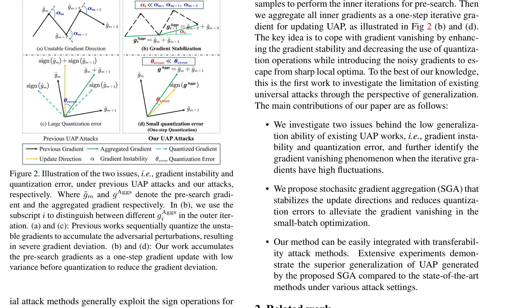
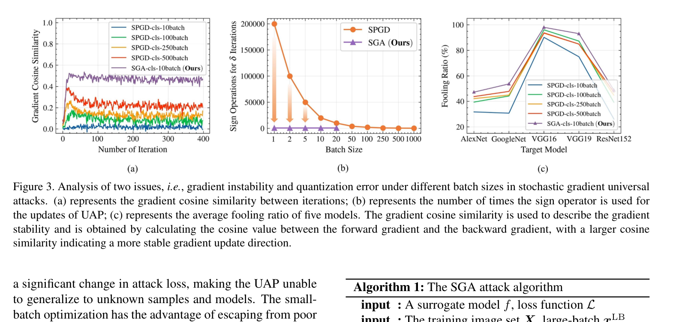
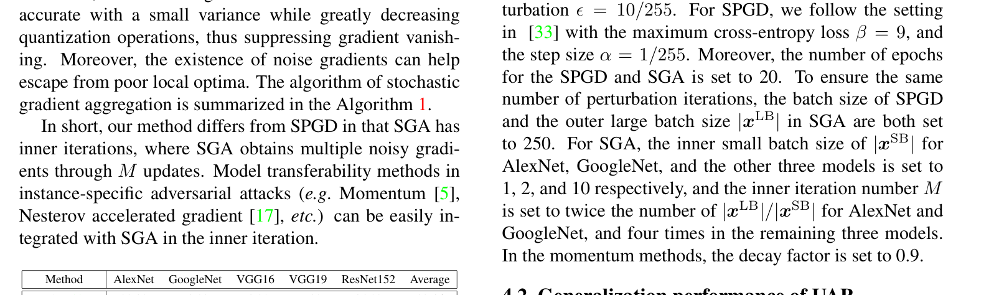
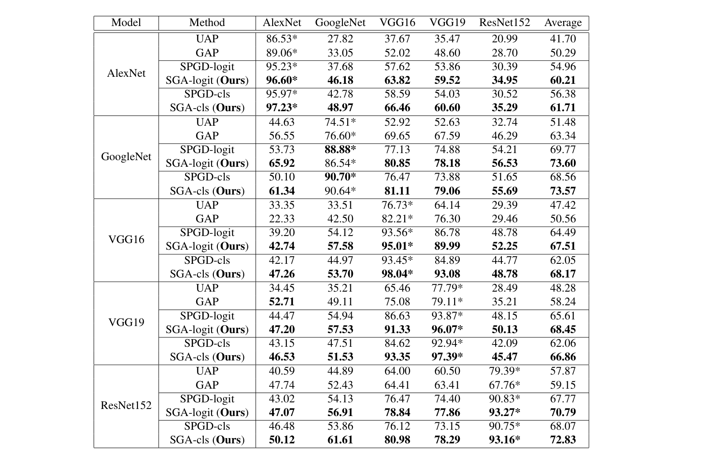
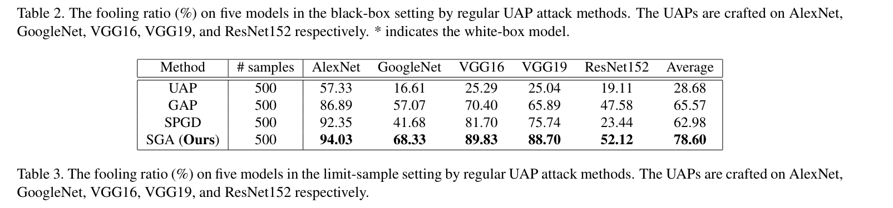
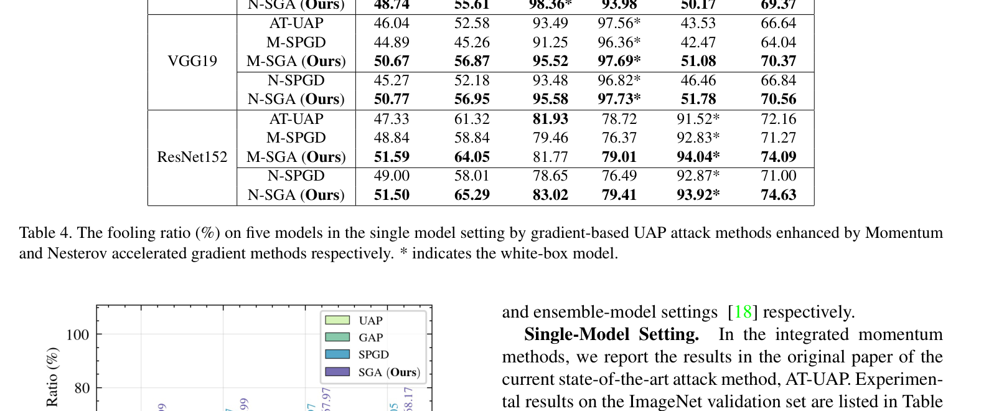
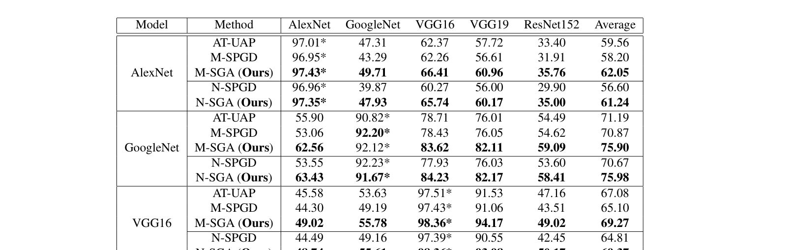
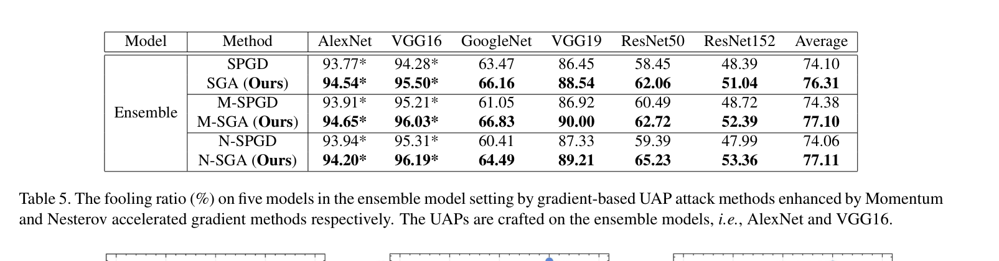
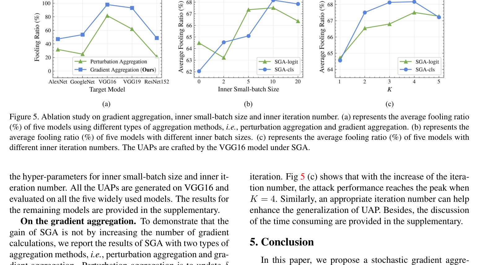

---
tags:
  - papers/adversarial-attacks
aliases:
  - SGA
  - Stochastic Gradient Aggregation
  - 梯度聚合通用对抗扰动
date: 2023-10
arxiv_id: "2308.06015"
---

# Enhancing Generalization of Universal Adversarial Perturbation through Gradient Aggregation

## 核心信息

- 标题: Enhancing Generalization of Universal Adversarial Perturbation through Gradient Aggregation
- 标题翻译: 通过梯度聚合增强通用对抗扰动的泛化性
- 作者: Xuannan Liu, Yaoyao Zhong, Yuhang Zhang, Lixiong Qin, Weihong Deng
- 机构: 北京邮电大学 (Beijing University of Posts and Telecommunications)
- 发表时间: 2023 年 10 月
- 发表渠道: ICCV 2023 (pp. 4435–4444)
- arXiv: 2308.06015
- 论文链接: https://openaccess.thecvf.com/content/ICCV2023/html/Liu_Enhancing_Generalization_of_Universal_Adversarial_Perturbation_through_Gradient_Aggregation_ICCV_2023_paper.html
- 代码 / 项目: https://github.com/liuxuannan/Stochastic-Gradient-Aggregation
- 论文类型: 方法 (method)

## 原文摘要翻译

深度神经网络容易受到通用对抗扰动 (UAP) 的攻击——这是一种与样本无关的扰动，能够使目标模型对大多数样本产生错误预测。与针对单个样本的对抗样本相比，UAP 的生成更具挑战性，因为它需要泛化到不同的样本和模型。本文从泛化视角审视了 UAP 生成方法面临的一个严峻困境：使用小批量随机梯度优化时的梯度消失问题，以及使用大批量优化时的局部最优问题。为解决这些问题，我们提出了一种简单有效的方法——随机梯度聚合 (SGA)，该方法同时缓解了梯度消失问题并帮助逃逸出不良局部最优。具体而言，SGA 采用小批量训练进行多次内部预搜索迭代，然后将所有内部梯度聚合为一步梯度估计，以增强梯度稳定性并减少量化误差。在标准 ImageNet 数据集上的大量实验表明，我们的方法显著增强了 UAP 的泛化能力，并优于其他最先进的方法。代码已开源。

## 创新点

1. **首次从泛化视角诊断 UAP 生成困境**：将 UAP 生成中的核心问题归结为梯度不稳定性 (gradient instability) 和量化误差 (quantization error) 两个维度。小批量训练梯度方差大、频繁使用 sign 操作累积量化误差导致梯度消失；大批量训练虽然梯度稳定但陷入尖锐局部最优、泛化性差。这一诊断框架为后续 UAP 研究提供了新的分析语言。

2. **随机梯度聚合 (SGA) 的 inner-outer 双循环设计**：SGA 在外部循环每次更新时，先以小批量样本进行 M 次内部预搜索（inner pre-search），收集所有内部梯度后聚合为一步梯度估计。这解决了核心的批量大小困境——小批量保证了泛化所需的噪声梯度（帮助逃逸尖锐局部最优），梯度聚合又抑制了梯度不稳定性（缓解梯度消失）。这种设计思路借鉴了深度学习大批量训练中"通过噪声逃逸"的直觉，但以完全不同的方式应用在了对抗扰动生成中。

3. **大幅减少 sign 量化操作**：传统 SPGD 每步迭代都应用一次 sign，而 SGA 将 M 步内部梯度聚合后才做一次 sign。在 M=40 的默认设置下，sign 调用次数减少到原来的 1/40，从根本上缓解了量化误差的累积。

## 一句话总结

SGA 通过 inner-outer 双循环设计将小批量训练的噪声梯度聚合为一步稳定的梯度估计，同时解决了 UAP 生成中的梯度消失和局部最优两个对立问题，在 ImageNet 上达到了 95.93% 的白盒平均欺骗率，黑盒迁移性也显著超越 SPGD 和所有先前的 UAP 方法。

## 研究背景与问题

### UAP 与实例对抗样本的本质差异

通用对抗扰动 (Universal Adversarial Perturbation, UAP) 由 Moosavi-Dezfooli et al. (CVPR 2017) 首次提出：寻找一个单一的、与输入无关的扰动 $\delta$，使得目标模型对数据分布中的大多数样本都产生错误预测。其优化目标为：

$$\arg\max_\delta \frac{1}{n} \sum_{i=1}^{n} \mathcal{L}(f(x_i + \delta), y_i), \quad \text{s.t.} \ \|\delta\|_\infty \leq \epsilon$$

这与实例对抗样本有本质区别：UAP 必须在有限的训练样本上生成，却要泛化到整个测试分布甚至跨模型。这种双重泛化需求使得 UAP 对优化过程的稳定性极其敏感。

### SPGD 的两个固有缺陷

当前 UAP 生成的主流方法是 SPGD (Stochastic PGD)——Shafahi et al. (AAAI 2020) 将随机梯度法与 PGD 结合用于加速 UAP 生成：

$$\tilde{g}_k = \frac{1}{|B_k|} \sum_{x_i \in B_k} \nabla_\delta \mathcal{L}(x_i + \delta_k), \quad \delta_{k+1} = \delta_k + \alpha \cdot \text{sign}(\tilde{g}_k)$$

SPGD 存在两个被本文首次系统诊断的缺陷：

1. **梯度不稳定性**：小批量训练下 $\tilde{g}_k$ 的方差很大，相邻迭代间的梯度方向剧烈波动，导致有效更新被抵消。Fig. 3(a) 显示小批量（batch=10）时相邻迭代梯度余弦相似度极低。

2. **量化误差累积**：每步迭代都使用 sign 操作将实值梯度量化为 $\pm 1$。当梯度方向不稳定时，sign 频繁改变符号，正向更新的梯度在下一步即被反向抵消。Fig. 3(b) 显示小批量方法 sign 使用次数远多于大批量方法。

*Fig. 2: Illustration of gradient instability and quantization error under previous UAP attacks versus SGA. (a)(c): Previous works sequentially quantize unstable gradients, causing severe gradient deviation. (b)(d): SGA accumulates pre-search gradients as a one-step update with low variance before quantization.*

### 大批量不是万能解

一个直觉性的改进是增大批量大小以稳定梯度——Fig. 3(c) 确实显示 batch=100 时攻击性能优于 batch=10。但过大的批量（如 batch=500）性能反而下降。这与 Keskar et al. (ICLR 2017) 的经典发现一致：大批量 SGD 倾向于收敛到尖锐局部最优（sharp minima），泛化性更差。UAP 生成因此面临一个两难困境：小批量梯度消失，大批量局部最优。

*Fig. 3: Analysis of gradient instability and quantization error under different batch sizes. (a) Gradient cosine similarity between iterations. (b) Number of times the sign operator is used. (c) Average fooling ratio of five models.*

## 方法主线

### 机制流程

SGA 的核心思想可概括为"用小批量做探索，用梯度聚合做稳定更新"。整体流程分三个层次：

**步骤 1（外部循环采样）：** 从训练集中随机采样一个大批量 $x^{LB}$，作为本轮外部迭代的"上下文"。

**步骤 2（内部预搜索）：** 在 $x^{LB}$ 内部，进行 $M$ 轮小批量预搜索。每轮随机采样一个小批量 $x^{SB}_m$，计算该小批量上的梯度，并累积到聚合梯度中：

$$g^{Aggs} = g^{Aggs} + \frac{1}{|x^{SB}_m|} \sum_{x_i \in x^{SB}_m} \nabla_\delta \mathcal{L}(x_i + \delta^{inner}_m)$$

注意内部循环中不进行任何 sign 操作——梯度以实值形式直接累积。

**步骤 3（一步更新）：** $M$ 轮内部搜索完成后，对聚合梯度做一次 sign 量化，更新外部扰动：

$$\delta \leftarrow \text{Clip}_\epsilon \left(\delta + \alpha \cdot \text{sign}(g^{Aggs})\right)$$

默认设置下，$M = K \times |x^{LB}| / |x^{SB}|$，其中 $K=4$ 表示每个样本在内部循环中被平均遍历 4 次。这意味着相比 SPGD，sign 调用次数减少了约 $M$ 倍。

### 为什么梯度聚合有效？

SGA 的设计可从三个互相增强的角度理解：

- **梯度稳定化**：累加 $M$ 步小批量梯度相当于增加了一次更新的有效样本量，降低了梯度估计的方差（与大批量训练类似），但保持了小批量训练的噪声特性（有利于逃逸尖锐局部最优）。

- **量化误差缩减**：sign 操作从每步一次变为每 $M$ 步一次。聚合后的梯度更准确地反映了跨样本的共识方向，sign 量化引入的偏差大幅减小。这是 SGA 相比简单增大批量的关键优势——它是在保持小批量探索的前提下减少 sign 调用。

- **噪声驱动的局部最优逃逸**：内部 $M$ 步预搜索中的梯度噪声起到了类似随机扰动的作用，帮助优化过程探索更平坦的损失区域（flat minima），从而获得更好的泛化性。

### 与已有方法的关键差异

SGA 与 Momentum-based 方法和 Nesterov accelerated gradient 方法是正交的——这些方法可以被集成到 SGA 的内部循环中（论文在 Table 4 和 Table 5 中验证了 M-SGA 和 N-SGA 的有效性）。SGA 解决的是批量选择困境，而 Momentum/Nesterov 解决的是优化路径的惯性保持问题。

## 实验设计

### 数据集与模型

- **训练数据**：ImageNet 训练集随机采样 10,000 张（每类 10 张），与 UAP 原始工作一致
- **评估数据**：ImageNet 验证集 50,000 张
- **目标模型**（白盒+黑盒，共 5 个）：AlexNet、GoogleNet、VGG16、VGG19、ResNet152
- **评估指标**：欺骗率 (Fooling Ratio)——施加 UAP 后标签发生改变的样本比例

### 攻击设置与超参数

- 扰动约束：$l_\infty$，$\epsilon = 10/255$
- 外部批量 $|x^{LB}| = 100$，内部小批量 $|x^{SB}| = 10$
- 内部遍历倍数 $K = 4$，即 $M = 4 \times 100 / 10 = 40$
- 优化器：SGD，步长 $\alpha = 1/255$
- 两种损失函数均实现：clipped cross-entropy loss（防止单样本 loss 爆炸）和 logit loss

### 基线方法

7 个 UAP 方法：UAP (CVPR 2017)、SV-UAP (CVPR 2018)、NAG (CVPR 2018)、GAP、DF-UAP (CVPR 2020)、Cos-UAP (ICCV 2021)、AT-UAP (AAAI 2022)。SPGD 作为直接的优化基线。还验证了 SGA 与 Momentum/Nesterov 的组合。

## 核心实验结果

### 白盒攻击：全面超越现有方法

*Table 1: Fooling ratio (%) in the white-box setting. The UAPs are crafted on five normally trained models.*

SGA 在所有五个模型上均取得最高欺骗率，平均 95.93%。特别值得注意的是：

- 在 VGG16 上达到 98.36%，ResNet152 上 94.04%——这两个模型在 UAP 原始工作中被认为相对难以攻击
- 相比最近的 AT-UAP (AAAI 2022)，平均提升约 1 个百分点；相比基于特征操纵的 Cos-UAP，提升约 1.7 个百分点
- 与经典 UAP (82.46%) 相比，提升超过 13 个百分点——考虑到这些方法共享相同的扰动约束和数据设置，这是实质性的改进

### 黑盒迁移：SGA 显著增强跨模型泛化

*Table 2: Fooling ratio (%) in the black-box setting. * indicates the white-box model. SGA consistently outperforms SPGD by 2.8%–6.3% on average across all source models.*

Table 2 的核心发现：

- **使用 clipped cross-entropy loss 时**：SGA 的平均黑盒欺骗率比 SPGD 高 5.2%（AlexNet 源）、3.8%（GoogleNet 源）、3.0%（VGG16 源）、2.8%（VGG19 源）、3.0%（ResNet152 源）
- **跨模型迁移的非对称性**：从 ResNet152 迁移到 AlexNet 的欺骗率（SGA: 47.07%）明显低于从 AlexNet 迁移到 ResNet152（SGA: 35.29%），这与对抗迁移性文献中的普遍观察一致——大模型到小模型的迁移通常更难
- SGA 对两种损失函数（logit loss 和 clipped cross-entropy loss）均有增益，表明梯度聚合的效果与具体损失函数选择正交

### 有限样本场景：SGA 高效利用稀缺数据

*Table 3: Fooling ratio (%) in the limit-sample setting (500 training samples).*

仅使用 500 张训练样本（正常设置的 5%）时，SGA 的平均欺骗率达到 78.60%，比 GAP 的 65.57% 高出 13 个百分点，比 SPGD 的 62.98% 高出 15.6 个百分点。这验证了 SGA 在数据稀缺场景下的优势——梯度聚合可以更充分地利用每张有限样本提供的梯度信息。

*Fig. 4: Average fooling ratio versus the number of training samples. SGA consistently outperforms SPGD across all sample sizes, with the gap widening as sample count increases.*

Fig. 4 进一步显示随着训练样本从 500 增加到 10,000，SGA 与 SPGD 的差距从约 15% 扩大到约 20%，说明 SGA 也能更大程度地受益于更多数据。

### 与 Momentum/Nesterov 的组合

*Table 4: Fooling ratio (%) with Momentum and Nesterov accelerated gradient. SGA-based methods consistently outperform SPGD-based counterparts by 2.8%–6.3%.*

M-SGA 在所有五个源模型上均超过 AT-UAP（当前最优）和 M-SPGD，平均黑盒欺骗率比 M-SPGD 高约 3.8%。N-SGA 的增益类似（约 4.1%）。这表明 SGA 的梯度聚合与 Momentum/Nesterov 的优化惯性是互补的效应——前者解决梯度稳定性，后者解决路径平滑性。

### 集成模型设置

*Table 5: Fooling ratio (%) in the ensemble-model setting (AlexNet + VGG16 as surrogates). SGA boosts all three baselines by about 2–3%.*

以 AlexNet 和 VGG16 为代理模型进行集成训练时，SGA 将 SPGD 的 74.10% 提升至 76.31%，M-SGA 达到 77.10%。集成增益（相比单模型）与 SGA 增益（相比 SPGD）是叠加的：集成+SGA+Momentum 组合的 N-SGA 达到 77.11%。对 ResNet50 的迁移率从约 59% 提升到约 65%（M-SGA），这是对未见模型架构泛化性的有力验证。

### 消融实验

*Fig. 5: Ablation studies. (a) Gradient aggregation vs perturbation aggregation. (b) Inner batch size. (c) Inner iteration number (K).*

- **梯度聚合 vs 扰动聚合** (Fig. 5a)：如果仅用内部循环的最终扰动直接作为更新（perturbation aggregation），性能明显低于梯度聚合。这说明 SGA 的增益不是简单地来自"多算了几步梯度"，而是梯度聚合本身抑制了梯度消失。
- **内部批量大小** (Fig. 5b)：$|x^{SB}| = 10$ 时性能最优。太大（20）退化为大批量方法、泛化性下降；太小（2）梯度噪声过大。
- **内部遍历倍数** (Fig. 5c)：$K = 4$ 时性能达到峰值。K 过小则梯度聚合不充分，K 过大则内部搜索过度拟合当前大批量、泛化性下降。

## 讨论与局限

### 论文证明了什么

论文比较扎实地证明了三件事：其一，UAP 生成中的小批量-大批量困境是一个真实存在且此前被忽视的问题——从梯度余弦相似度、sign 调用次数、欺骗率三个指标看到了一致的诊断结果。其二，SGA 的 inner-outer 双循环设计可以有效调和这个矛盾——所有实验设置（白盒、黑盒、有限样本、Momentum 增强、集成模型）下 SGA 均一致优于 SPGD。其三，梯度聚合比扰动聚合更有效，排除了"多算梯度自然更好"的 trivial 解释。

### 论文没有证明什么

1. **SGA 对 ViT 架构的有效性**：全部实验使用 CNN 模型（AlexNet 到 ResNet152）。在 ViT 上的 UAP 泛化性未经验证。考虑到 CNN 和 ViT 的梯度模式存在结构性差异（见 AdaEA 论文中 Fig. 2 的梯度余弦相似度热力图），SGA 能否在 ViT 上保持同样的优势是未知的。

2. **非分类任务的 UAP**：实验仅覆盖图像分类。目标检测、语义分割、人脸识别等下游任务上的 UAP 泛化性未涉及，而这些正是 UAP 实际威胁较大的场景。

3. **SGA 的计算开销分析**：内部 M=40 轮预搜索带来了约 40 倍的正反向传播开销。论文仅在补充材料中讨论了耗时问题。实际使用中需要在攻击效果和生成效率之间做权衡。

4. **对抗训练模型的鲁棒性**：所有目标模型均为标准训练。UAP 对对抗训练模型的欺骗率如何、SGA 是否仍然有效，均未讨论。

### 值得关注的局限

- **SGA 与迁移增强方法的正交性未被穷举**：论文仅验证了与 Momentum 和 Nesterov 的组合。与其他迁移增强技术（如 input diversity、translation invariance、variance tuning）的组合效果未知。
- **UAP 的跨任务可迁移性**：论文未讨论在 ImageNet 上生成的 UAP 能否迁移到其他视觉任务。这对于理解 UAP 的"通用性"边界很重要。
- **防御评估的缺失**：没有测试 SGA 生成的 UAP 在对抗训练防御或输入变换防御下的表现，而这是评估 UAP 实用威胁性的标准流程。

## 总结与启发

### 方法论层面的启发

SGA 的核心设计哲学是"用小批量做探索、用聚合做稳定"，这在概念上与分布式训练中的梯度累积 (gradient accumulation) 有关，但应用目标完全不同——这里不是为了模拟大批量以节省显存，而是为了在保持噪声驱动探索的同时抑制梯度消失。这种思路可以推广到其他需要在"噪声探索"与"稳定更新"之间做权衡的优化场景。

### 工程复用指南

- 在现有 SPGD 代码中引入 SGA 的改动量很小：在外部循环中插入一个 for 循环做 M 次预搜索、累积梯度、最后做一次 sign 更新。默认设置 $|x^{LB}|=100, |x^{SB}|=10, K=4$ 在大多数场景下应该有效。
- 如果训练样本极少（如 500 张），SGA 相对于 SPGD 的优势尤为突出，是有限样本场景下的首选。
- 可以放心地将 SGA 与 Momentum（或 Nesterov）结合使用——两者互补。

### 后续研究可以关注的方向

1. SGA 对 ViT 等新架构的 UAP 生成效果如何？
2. 内部遍历倍数 K 是否可以自适应调整（如根据梯度方差大小动态决定 M）？
3. SGA + 输入变换（如多样性输入）能否进一步提升黑盒迁移性？
4. UAP 在目标检测/分割/人脸识别等下游任务上的跨任务泛化性如何？SGA 能否在这些任务上保持优势？
5. 梯度聚合的思想能否用于对抗训练防御方（即用 SGA 生成更强的 UAP 来增强对抗训练）？

## 参考文献与后续阅读

核心被引文献：

- **UAP 起源**: Moosavi-Dezfooli et al., "Universal Adversarial Perturbations", CVPR 2017 — 首次发现通用对抗扰动的存在
- **SPGD**: Shafahi et al., "Universal Adversarial Training", AAAI 2020 — 将随机梯度法引入 UAP 生成
- **大批量泛化困境**: Keskar et al., "On Large-Batch Training for Deep Learning: Generalization Gap and Sharp Minima", ICLR 2017 — 提供大批量 → 尖锐局部最优的理论基础
- **AT-UAP**: Li et al., "Learning Universal Adversarial Perturbation by Adversarial Example", AAAI 2022 — 当前最优 UAP 方法之一
- **Cos-UAP**: Zhang et al., "Data-Free Universal Adversarial Perturbation and Black-Box Attack", ICCV 2021 — 无数据 UAP 生成
- **DF-UAP**: Zhang et al., "Understanding Adversarial Examples from the Mutual Influence of Images and Perturbations", CVPR 2020
- **Momentum MI-FGSM**: Dong et al., "Boosting Adversarial Attacks with Momentum", CVPR 2018
- **Nesterov NI-FGSM**: Lin et al., "Nesterov Accelerated Gradient and Scale Invariance for Adversarial Attacks", ICLR 2020

---

*笔记生成日期：2026-06-12*
