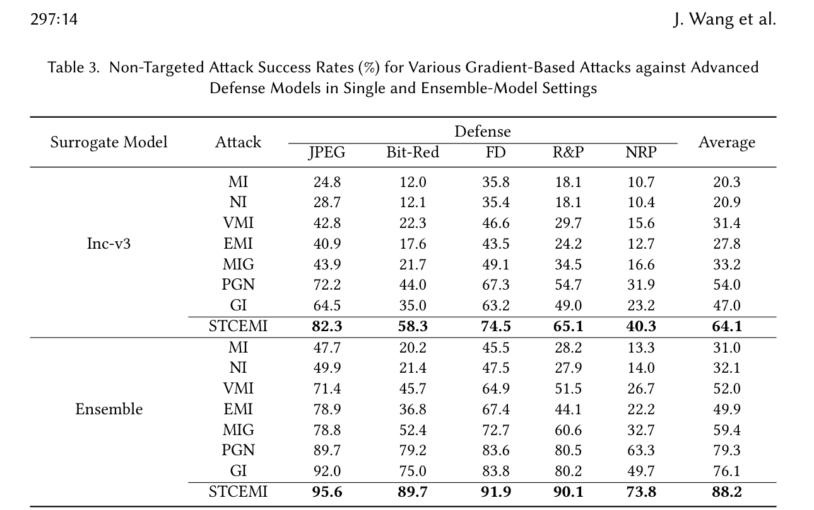

---
tags:
  - papers/adversarial-attacks
aliases:
  - STCEMI
  - Spatio-Temporal Context Enhanced Momentum Iteration
  - 时空上下文增强动量攻击
date: 2025-10
doi: "10.1145/3766545"
---

# Boosting Transferability of Adversarial Examples with Spatio-Temporal Context

## 核心信息

- 标题: Boosting Transferability of Adversarial Examples with Spatio-Temporal Context
- 标题翻译: 利用时空上下文提升对抗样本的可迁移性
- 作者: Jingtian Wang, Xiaolong Li, Bin Ma, Yao Zhao
- 机构: 北京交通大学; 齐鲁工业大学 (山东省)
- 发表时间: 2025 年 10 月
- 发表渠道: ACM Transactions on Multimedia Computing, Communications, and Applications (TOMM), Vol. 21, No. 10, Article 297
- DOI: 10.1145/3766545
- 论文类型: 方法 (method)

## 原文摘要翻译

可迁移对抗样本因其在多模型上的欺骗能力而受到越来越多的关注，但现有攻击在迁移性方面表现仍然不够好。为此，本文提出了一种新的攻击方法——==基于时空上下文的增强动量迭代 (STCEMI)==。首先，分别设计了面向空间和面向时间的上下文利用策略。一方面，将原始图像的随机打乱版本与自身相加获得混合图像，利用混合图像优化扰动，实现空间上下文动量对当前位置梯度的修正。另一方面，通过沿前向和后向梯度方向各进行单步迭代获取短时上下文，其时间上下文动量用于修正当前迭代的梯度。其次，考虑到空间和时间上下文的互补性，将两种策略自然融合，构建了基于时空上下文的攻击方法 STCEMI，以实现更强的迁移性。大量实验结果表明，STCEMI 生成的对抗图像在多个主流正常训练和对抗训练模型上均取得了最高的跨模型攻击成功率。

## 创新点

1. **从时空双维度重新审视迁移攻击的迭代机制**：论文首次将对抗样本的迭代生成过程分别从空间维度和时间维度进行系统分析。空间维度上，I-FGSM 仅用当前位置梯度（迁移差），DI-FGSM 交替使用当前位置和交叉位置梯度（不平衡），TI-FGSM 仅用邻域上下文（范围窄）。时间维度上，MI/NI-FGSM 仅用历史/未来梯度（粒度粗）。STCEMI 在这两个维度上同时引入了更精密的上下文利用策略。

2. **全局空间上下文 (SCEMI)**：通过随机打乱-混合图像的机制，*使每个像素的梯度同时融合当前位置和全局随机位置的梯度信息*。与 TI-FGSM 的邻域上下文（仅 3×3 或 5×5 卷积核范围）相比，全局空间上下文的梯度方向多样性更丰富，能更有效地缓解对代理模型的过拟合。更重要的是，通过超参数 η 控制打乱图像的参与程度，保证了白盒攻击能力不被削弱。

3. **短时时间上下文 (TCEMI)**：受视频插帧技术的启发，在当前迭代位置进行前向和后向各一步的单步探索，获得"短时上下文"梯度，用于修正当前梯度方向。这与传统的长期动量（MI-FGSM，仅累积历史梯度）形成互补——长期动量为粗粒度的平滑，短时上下文为细粒度的方向修正。实验证明 TCEMI 优于 SCEMI，暗示短时时间上下文与传统动量的互补性更强。

4. **即插即用的通用增强模块**：时空上下文动量可以无缝嵌入任何基于梯度优化或输入变换的现有攻击方法中。实验验证了对 10 种现有攻击（4 种输入变换方法 + 6 种梯度优化方法）的提升均显著（平均 11.4%~35.3% 的绝对提升）。

## 一句话总结

STCEMI 通过全局空间上下文（随机打乱-混合图像）和短时时间上下文（前后向单步探索）两个互补策略修正当前梯度方向，在空间和时间两个维度上同时稳定迭代路径并消除不良局部最优，作为即插即用模块可将 MI 基线攻击成功率从 43% 提升至 85.7%（单模型）和 96.7%（集成模型），对防御模型的平均攻击率从 20.3% 提升至 64.1%。

## 研究背景与问题

### ⭐时空维度下的攻击机制重新审视

论文对主流迁移攻击的迭代策略进行了系统性的时空二维分类：

- **空间维度**：I-FGSM 仅使用当前位置的梯度信息——更新过程中每个像素的修改方向完全由自身梯度决定，没有任何跨位置信息的参与。DI-FGSM 以一定概率对输入做随机变换，导致部分迭代使用交叉位置梯度——但这在当前位置和交叉位置之间交替切换，无法同时受益。TI-FGSM 通过卷积核引入邻域上下文，但局限于 3×3 或 5×5 范围内，像素相似性导致梯度方向差异不大，增强效果有限。

- **时间维度**：I-FGSM 每次迭代完全独立，不使用任何历史信息。MI-FGSM 通过指数衰减累积历史梯度（长期动量），在时间轴上做了粗粒度平滑。NI-FGSM 通过预前更新引入"未来"梯度的预期——但这仍是沿优化路径的单方向延伸。

核心洞察是：现有方法在空间或时间维度上都只做了粗粒度的局部修正，而更精细、更全局的时空上下文信息尚未被充分利用。

### STCEMI 的核心动机

![[1_fig2.jpg]]
如图 2 所示，对于当前对抗样本的第 t 步迭代中的任意像素（红色方块），其空间上下文（绿色方块）和时序上下文（黄色方块）蕴含了大量未被现有方法利用的有用信息。STCEMI 的目标是通过两个专门设计的策略（SCEMI 和 TCEMI）系统地开发这些上下文信息，以稳定迭代方向、消除不良局部最优，从而提升迁移性。

## 方法主线

### 机制流程

STCEMI 的每次迭代按以下流程执行：

**步骤 1（空间上下文获取 - SCEMI）：** 对当前对抗样本 $x^{adv}_t$ 进行 M 次随机水平或垂直打乱，每次将打乱版本与原图按权重 η 混合生成混合图像 $x^{ble}_{t,i}$，计算各混合图像上的梯度并取平均，获得空间上下文修正梯度 $g^{sce}_t$。

**步骤 2（时间上下文获取 - TCEMI）：** 对当前对抗样本 $x^{adv}_t$，沿前向和后向梯度方向各进行单步迭代，获得两个短时上下文样本 $x^{adv}_{t,+}$ 和 $x^{adv}_{t,-}$。再通过邻域采样（添加均匀随机噪声）增强上下文利用，计算修正后的梯度 $g^{tce}_t$。

**步骤 3（时空融合与动量更新）：** 将空间和时间上下文信息融合到当前梯度中，结合传统长期动量，得到增强的动量 $g_t$，以此确定当前迭代的更新方向。

### 全局空间上下文策略 (SCEMI)

SCEMI 的核心操作是三个关键步骤：

**随机打乱 (Scramble)：** 以概率 p 进行水平打乱 $h_s(x^{adv}_t)$，以概率 1-p 进行垂直打乱 $v_s(x^{adv}_t)$。水平打乱是将图像沿水平方向随机排列，垂直打乱同理。

**图像混合 (Blend)：** 将原始图像与打乱版本按比例 η 混合：
$$x^{ble}_t = x^{adv}_t + \eta \cdot SCM(x^{adv}_t; p)$$

关键设计：混合后的图像同时包含了原始的当前位置信息和打乱后的全局空间上下文信息。η 控制空间上下文的参与强度（默认 η=0.2），确保空间上下文梯度不会主导更新方向而损害白盒性能。

**多轮平均 (Multi-round averaging)：** 进行 M 次随机打乱（默认 M=10），计算 M 个混合图像的梯度并取平均：
$$g^{sce}_t = \frac{1}{M} \sum_{i=1}^{M} \nabla_{x^{ble}_{t,i}} J(f(x^{ble}_{t,i}), y)$$

M 次打乱相当于从全局空间上下文中采样 M 个不同的扰动分布，平均后得到的梯度方向更稳定、更能代表跨位置的共识方向。这与 TI-FGSM 仅使用固定卷积核的邻域平滑有本质区别——SCEMI 的上下文范围是整个图像。

### 短时时间上下文策略 (TCEMI)

TCEMI 受视频插帧技术的启发：在连续帧之间插入补充帧以增强流畅性。类似地，在对抗攻击的迭代路径上，可以在"当前步"和"前后各一步"的位置插入"短时上下文样本"：

$$\begin{aligned} x^{adv}_{t,-} &= x^{adv}_t - \alpha \cdot \frac{\nabla_{x^{adv}_t} J(f(x^{adv}_t), y)}{\|\nabla_{x^{adv}_t} J(f(x^{adv}_t), y)\|_1} \\ x^{adv}_{t,+} &= x^{adv}_t + \alpha \cdot \frac{\nabla_{x^{adv}_t} J(f(x^{adv}_t), y)}{\|\nabla_{x^{adv}_t} J(f(x^{adv}_t), y)\|_1} \end{aligned}$$

这两个样本分别位于当前优化路径的"前一步"和"后一步"位置。它们的梯度用于修正当前梯度：

$$g^{cor}_t = \nabla_{x^{adv}_t} J + \lambda \cdot \nabla_{x^{adv}_{t,-}} J + (1-\lambda) \cdot \nabla_{x^{adv}_{t,+}} J$$

其中 λ（默认 0.5）平衡前向和后向短时上下文梯度的权重。

**邻域采样增强：** 为进一步稳定利用短时上下文，引入均匀分布随机噪声 $ε ∈ [-r, r]$（r = 3.0ε），对当前样本 $x^{adv}_t$ 进行 N 次邻域采样（默认 N=10），每次对采样样本计算其对应的短时上下文修正梯度，最后取平均。

TCEMI 与传统长期动量的关键区别：长期动量是对过去所有迭代梯度的粗粒度指数衰减累积，而 TCEMI 的短时上下文是在当前迭代位置做精密的局部探索——前者提供方向稳定性，后者提供局部地形修正。

### 时空融合：STCEMI 的完整形式

![[2_algorithm.jpg]]
最终的迭代更新方向综合了三类信息：传统长期动量、SCEMI 空间上下文动量、TCEMI 短时上下文动量。三者通过算法 1 中定义的方式进行融合。这种融合使得每次更新既能保持优化路径的惯性（长期动量），又能利用当前位置的全局空间信息（防止梯度过拟合），同时参考前后邻域的地形特征（消除不良局部最优）。

## 实验设计

### 数据集与模型

- **数据集**：ImageNet-compatible 数据集 1,000 张图像
- **正常训练目标模型（5 个）**：Inc-v3, Inc-v4, IncRes-v2, Res-101, Res-152
- **对抗训练目标模型（3 个）**：Inc-v3_ens3, Inc-v3_ens4, IncRes-v2_ens
- **防御方法（5 个）**：R&P, FD, Bit-Red, JPEG, NRP
- **代理模型**：Inc-v3, Inc-v4, IncRes-v2, Res-101；集成设置下为 Inc-v3 + Inc-v4 + IncRes-v2

### 攻击设置与超参数

- 详细参数设置见论文4.1

### 基线方法

7 个直接可比的梯度优化攻击：MI-FGSM, NI-FGSM, VMI-FGSM, EMI-FGSM, MIG, PGN, GI。还验证了 SCEMI 和 TCEMI 作为即插即用模块对 10 种现有攻击（DIM, TIM, SIM, SSA, SIA; MI, NI, VMI, EMI, MIG, PGN）的增强效果。

## 核心实验结果

### 单模型攻击：STCEMI 在所有设定下全面领先

![[3_tablt1.jpg]]
*Table 1: Non-targeted attack success rates (%) in single-model setup. * denotes white-box.*

- 以 Inc-v3 为代理模型时，STCEMI 平均黑盒 ASR 达 85.7%，比 PGN（76.7%）高 9.0%，比 GI（70.0%）高 15.7%
- 以 IncRes-v2 为代理模型时，STCEMI 平均达 90.5%，对 Res-101 的迁移率 91.0%（比 PGN 高 7.5 个百分点）
- 对三个对抗训练模型，STCEMI 在所有代理模型设置下均取得最优，如用 Res-101 作为源时对防御模型平均 61.7%（PGN 为 58.9%）
- 值得一提的是 PGN（NeurIPS 2023）在正常训练模型上已经很强大（平均 76.7%），但在防御模型上被 STCEMI 拉开明显差距（对抗训练模型上差距约 14%）

### 集成模型攻击：更显著的领先优势

![[4_table2.jpg]]
*Table 2: Attack success rates (%) in ensemble-model setup.*

选取Inc - v3、Inc - v4、IncRes - v2三个正常训练的模型作为代理模型，并赋予每个模型相同的权重

- STCEMI 平均 ASR 达 96.7%，比 PGN（92.8%）高 3.9%，比 GI（92.2%）高 4.5%
- 在对抗训练模型上优势更加明显：对 IncRes-v2_ens，STCEMI 达 90.4%（PGN 为 79.2%，差距 11.2 个百分点）
- 对 Res-101 和 Res-152（均未参与集成），STCEMI 分别为 96.9% 和 97.1%，接近白盒水平

### 防御模型攻击：鲁棒性优势显著

*Table 3: Attack success rates against five advanced defense models.*

- 单模型设置（Inc-v3 代理）：STCEMI 平均 64.1%，PGN 为 54.0%，MI 仅 20.3%
- 集成设置：STCEMI 平均 88.2%，PGN 为 79.3%
- 对 JPEG 压缩、Bit-Red 这类强防御，STCEMI 相比 PGN 提升尤为显著（JPEG：72.2%→82.3%；Bit-Red：44.0%→58.3%）

### 组件消融：空间与时间上下文各自独立且互补

![[5_table4.jpg]]
*Table 4: Component ablation. MI (baseline), SCEMI (+spatial), TCEMI (+temporal), STCEMI (both).*

- SCEMI 相比 MI：平均提升 12.9%（Inc-v3 源）至 15.0%（IncRes-v2 源）
- TCEMI 相比 MI：平均提升 34.0%（Inc-v4 源）至 32.8%（Res-101 源）
- STCEMI 在 SCEMI 和 TCEMI 基础上进一步提升，证明两者互补
- 一个有趣发现：TCEMI 单独的效果优于 SCEMI 单独——这可能因为 TCEMI 的短时动量与传统长期动量（MI 已包含）具有更强的相关性和互补性
- 集成设置下 TCEMI 达到 93.2%，已接近 STCEMI 的 96.6%

### 即插即用：对 10 种现有攻击的一致增强

![[Papers/Adversarial-Attacks/STCEMI/images/6.jpg]]
*Fig. 6: STCEMI integrated with DIM, TIM, SIM, SSA.*

- TIM + 时空上下文：六目标平均从 ~38% 提升至 ~72%，绝对提升 34%+
- DIM + 时空上下文：六目标平均从 ~54% 提升至 ~80%

![[Papers/Adversarial-Attacks/STCEMI/images/7.jpg]]
*Fig. 7: STCEMI integrated with MI, NI, VMI, EMI, MIG, PGN.*

- 六种梯度优化方法的平均 ASR 分别从 33.6%, 39.2%, 53.1%, 52.0%, 50.9%, 72.8% 提升至 63.6%, 52.3%, 69.4%, 76.6%, 83.0%, 84.2%
- 绝对提升幅度为 11.4% 至 32.1%，验证了时空上下文的通用增强能力
- 值得注意的是，PGN（当时 SOTA）集成了时空上下文后进一步提升至 84.2%

### SCEMI 与输入变换方法的对比优势

![[8_table5.jpg]]
*Table 5: TCEMI integrated with DIM, TIM, SIM, SSA, SIA, and our SCEMI.*

- STCEMI（SCEMI+TCEMI 组合）在大部分场景下优于 DIM/SIM/SSA/SIA+TCEMI
- 以 TCEMI 为基线，集成输入变换方法后的提升均不如 SCEMI 的提升显著，证明全局空间上下文（SCEMI）相比现有的输入变换方法（DIM/TIM/SIM/SSA/SIA）具有互补性更强的优势

### 超参数分析

![[9_parameter.jpg]]
*Fig. 5: Hyper-parameter analysis. Inc-v3 as surrogate.*

- **邻域采样数 N 和随机打乱数 M**：随 N/M 增加 ASR 上升，N=M=10 时趋于稳定——更多采样带来更稳定的梯度估计，但边际收益递减
- **空间上下文强度 η**：过高时空间上下文梯度主导更新方向，损害白盒性能；过低时增强效果不足；η=0.2 取得最优
- **平衡系数 λ 和 p**：λ=0.5, p=0.5 时取得最佳平衡——λ 偏向任一侧（纯前向或纯后向短时上下文）都会降低性能

### 注意力可视化分析

![[10_fig8.jpg]]
*Fig. 8: Attention maps of benign images and STCEMI adversarial examples.*

Grad-CAM 可视化显示：STCEMI 生成的对抗样本在代理模型 (Inc-v3) 上的注意力完全偏离了真实标签对应的关键物体（如洗衣机），而在目标模型 (Res-101) 上的注意力同样被引导到了与真实标签无关的区域。两个模型的注意力同时偏离——这表明 STCEMI 的时空上下文策略成功找到了跨模型共享的对抗语义空间。

## 讨论与局限

### 论文证明了什么

论文扎实地证明了三个核心命题：第一，从时空二维重新分类和分析现有迁移攻击的迭代策略是一个有效且有洞察力的分析框架——SCEMI 和 TCEMI 分别对应了这个分析框架中的两个缺失维度。第二，全局空间上下文（跨位置打乱-混合）优于邻域上下文（TI-FGSM 的卷积核）和交替上下文（DI-FGSM 的随机变换），短时时间上下文（前后向单步探索）与长期动量互补。第三，时空上下文是一个通用的、正交于现有攻击范式的增强维度——可以即插即用到 10 种不同攻击上并获得一致提升。

### 论文没有证明什么

1. **对 ViT 的跨架构迁移性**：所有目标模型均为 CNN 架构。在 ViT 上的表现未被评估。考虑到 CNN 和 ViT 在空间归纳偏置上的本质差异（CNN 局部连接 vs ViT 全局注意力），全局空间打乱策略在 ViT 上是否仍然有效是未知的关键问题。

2. **计算开销的量化分析**：每次迭代需要 M×N 次额外前向传播和 N×2 次短时上下文探索，总计约 30 倍的开销（相比基础 MI-FGSM）。论文未讨论时间消耗。

3. **与其他迁移方法的组合上限**：SCEMI/TCEMI 与特征级攻击（FIA, NAA, CRFA）、频率域攻击（SSA）、集成攻击（Ensemble）等方法结合的效果未探索——这些方法与 STCEMI 在机制上也是正交的。

### 值得关注的局限

- **打乱策略的局限性**：水平/垂直方向打乱对旋转和平移不敏感的图像可能效果有限。更通用的几何变换（affine、perspective）是否有效未被探索。
- **η 与攻击预算的耦合**：η=0.2 的调优仅在 ε=16/255 下验证。不同扰动预算可能需要不同的空间上下文强度。
- **TCEMI 强于 SCEMI 的含义**：这可能暗示在 STCEMI 的场景中（代理模型为 Inc-v3 等标准 CNN），时间维度的修正比空间维度的修正更重要——但这一结论能否推广到 ViT 等架构未知。

## 总结与启发

### 方法论层面的启发

STCEMI 最值得借鉴的思维方式是：不从零设计新的攻击算法，而是退一步审视现有攻击在"哪些信息维度上做了利用、哪些维度上还没有"。论文对 I-FGSM → MI-FGSM → DI/TI-FGSM 的演进做了清晰的二维分类，然后补上了"全局空间"和"短时时间"两个缺失维度。这种"维度分析 → 缺口填补"的方法论在攻击设计领域具有通用性。

### 工程复用指南

- SCEMI/TCEMI 的实现只需在现有攻击的每次迭代中插入额外的梯度计算和平均步骤，改动量很小。
- 默认参数（N=M=10, η=0.2, λ=p=0.5, r=3.0ε）在 ImageNet 场景下表现稳定，可直接复用。
- 如果目标模型已知包含 ViT，建议额外验证——全局空间打乱在 ViT 上的效果可能不同于 CNN。

### 后续研究可以关注的方向

1. STCEMI 在 ViT 目标上的迁移效果如何？全局空间上下文在自注意力机制下是否仍然有效？
2. 更复杂的空间变换（affine, elastic）能否进一步提升全局上下文质量？
3. STCEMI 与特征级攻击（FIA, NAA, CRFA）的结合能否产生叠加增益？
4. 短时时间上下文是否可以从当前的 ±1 步扩展到 ±k 步？能否自适应确定最优步数？

## 参考文献与后续阅读

核心被引文献：

- **MI-FGSM**: Dong et al., "Boosting Adversarial Attacks with Momentum", CVPR 2018 — 长期动量的基础
- **NI-FGSM**: Lin et al., "Nesterov Accelerated Gradient and Scale Invariance for Adversarial Attacks", ICLR 2020 — 预前更新
- **DI-FGSM**: Xie et al., "Improving Transferability of Adversarial Examples with Input Diversity", CVPR 2019
- **TI-FGSM**: Dong et al., "Evading Defenses to Transferable Adversarial Examples by Translation-Invariant Attacks", CVPR 2019
- **VMI-FGSM**: Wang & He, "Enhancing the Transferability of Adversarial Attacks through Variance Tuning", CVPR 2021
- **EMI-FGSM**: Wang et al., "Boosting Adversarial Transferability through Enhanced Momentum", BMVC 2021
- **PGN**: Ge et al., "Boosting Adversarial Transferability by Achieving Flat Local Maxima", NeurIPS 2023 — 当时 SOTA 梯度攻击
- **Grad-CAM**: Selvaraju et al., "Grad-CAM: Visual Explanations from Deep Networks via Gradient-based Localization", ICCV 2017

---

*笔记生成日期：2026-06-15*
